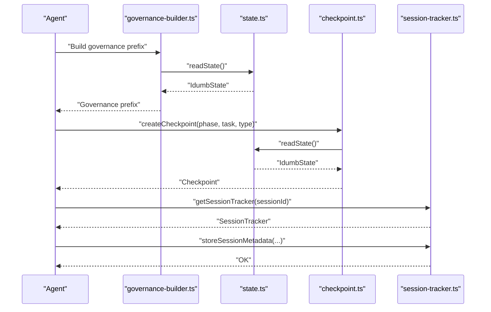
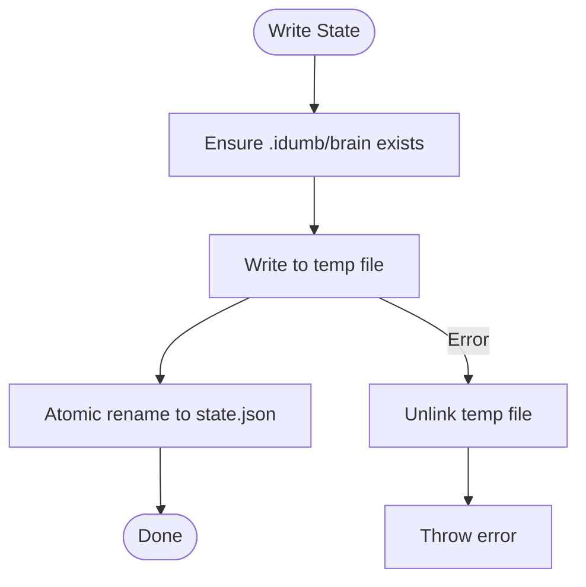
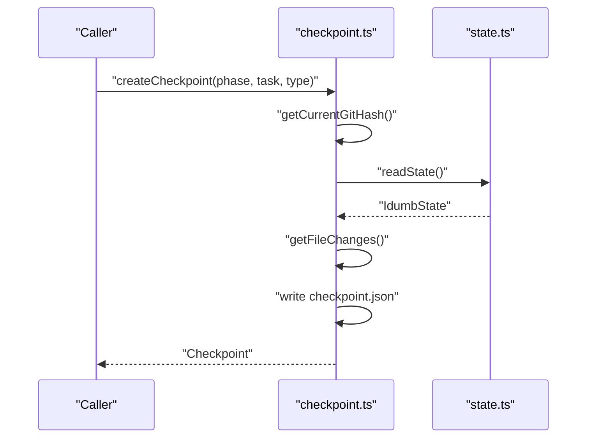
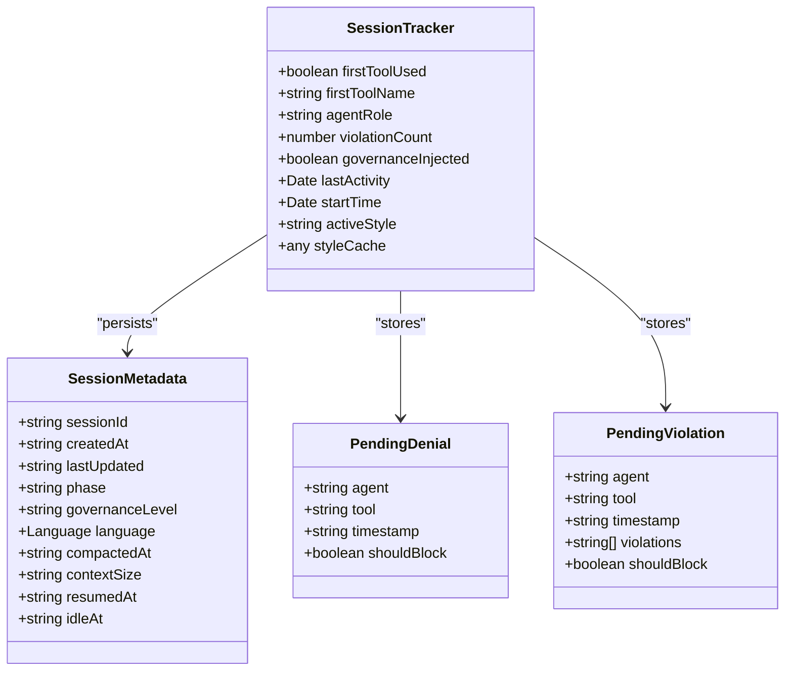
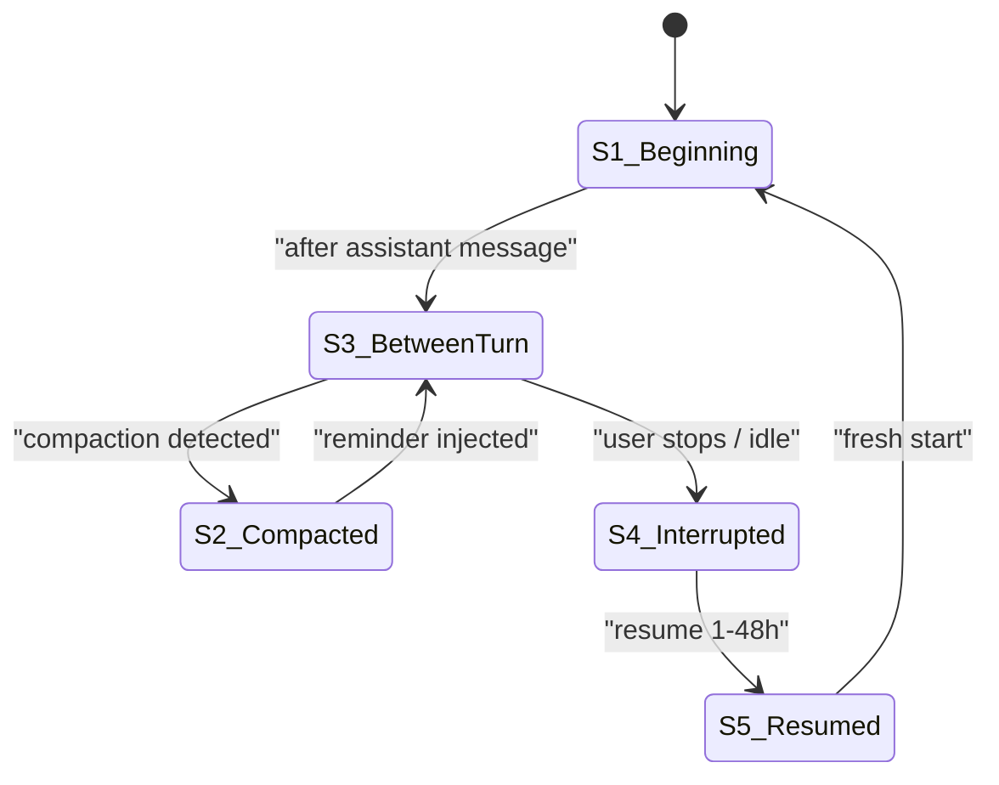
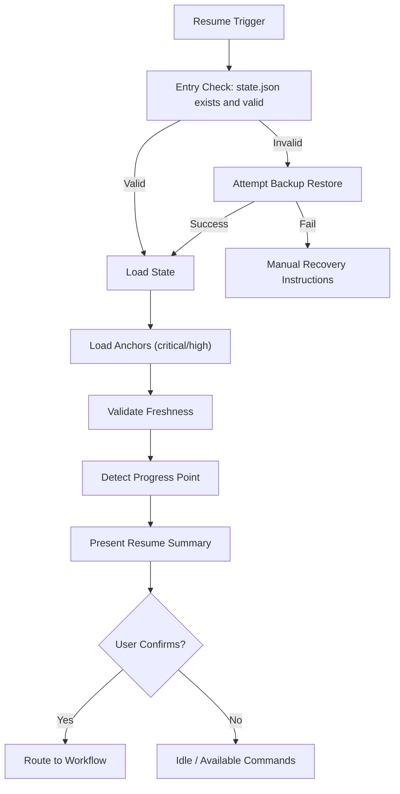
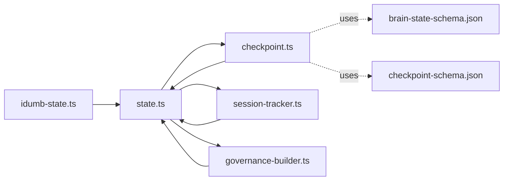

# State Management

<cite>
**Referenced Files in This Document**
- [src/plugins/lib/state.ts](file://src/plugins/lib/state.ts)
- [src/plugins/lib/checkpoint.ts](file://src/plugins/lib/checkpoint.ts)
- [src/plugins/lib/session-tracker.ts](file://src/plugins/lib/session-tracker.ts)
- [src/plugins/lib/types.ts](file://src/plugins/lib/types.ts)
- [src/plugins/lib/governance-builder.ts](file://src/plugins/lib/governance-builder.ts)
- [src/tools/idumb-state.ts](file://src/tools/idumb-state.ts)
- [src/schemas/brain-state-schema.json](file://src/schemas/brain-state-schema.json)
- [src/schemas/checkpoint-schema.json](file://src/schemas/checkpoint-schema.json)
- [src/references/continuation-format.md](file://src/references/continuation-format.md)
- [src/workflows/resume-project.md](file://src/workflows/resume-project.md)
- [src/router/SESSION-STATES-GOVERNANCE.md](file://src/router/SESSION-STATES-GOVERNANCE.md)
- [src/plugins/lib/schema-validator.ts](file://src/plugins/lib/schema-validator.ts)
</cite>

## Table of Contents
1. [Introduction](#introduction)
2. [Project Structure](#project-structure)
3. [Core Components](#core-components)
4. [Architecture Overview](#architecture-overview)
5. [Detailed Component Analysis](#detailed-component-analysis)
6. [Dependency Analysis](#dependency-analysis)
7. [Performance Considerations](#performance-considerations)
8. [Troubleshooting Guide](#troubleshooting-guide)
9. [Conclusion](#conclusion)
10. [Appendices](#appendices)

## Introduction
This document explains iDumb’s governance state architecture and persistence mechanisms. It covers the brain state structure (state.json), history and context preservation, checkpoint systems, session tracking and metadata, continuation format for resumption, validation and recovery, and the relationship between state changes and agent operations. It also addresses migration, versioning, and backward compatibility considerations, and provides practical examples for state manipulation, inspection, and debugging.

## Project Structure
The state management system spans several modules:
- Persistent state: .idumb/brain/state.json with JSON Schema validation
- Execution checkpoints: .idumb/brain/execution/{phase}/checkpoint-*.json
- Session metadata: .idumb/sessions/{sessionId}.json
- Governance and session state machine: session state transitions and agent role enforcement
- Tools for state inspection/manipulation and continuation formatting

```mermaid
graph TB
subgraph "Persistent Storage"
A[".idumb/brain/state.json"]
B[".idumb/brain/execution/{phase}/checkpoint-*.json"]
C[".idumb/sessions/{sessionId}.json"]
end
subgraph "Runtime Modules"
D["state.ts<br/>read/write state, history, anchors"]
E["checkpoint.ts<br/>create/load/list checkpoints"]
F["session-tracker.ts<br/>in-memory tracker + metadata"]
G["governance-builder.ts<br/>permissions, reminders, prefixes"]
H["idumb-state.ts<br/>CLI tools for state ops"]
end
A <- --> D
A <- --> E
A <- --> F
A <- --> G
H --> D
E --> A
F --> C
```

**Diagram sources**
- [src/plugins/lib/state.ts](file://src/plugins/lib/state.ts#L34-L101)
- [src/plugins/lib/checkpoint.ts](file://src/plugins/lib/checkpoint.ts#L123-L204)
- [src/plugins/lib/session-tracker.ts](file://src/plugins/lib/session-tracker.ts#L204-L244)
- [src/plugins/lib/governance-builder.ts](file://src/plugins/lib/governance-builder.ts#L200-L346)
- [src/tools/idumb-state.ts](file://src/tools/idumb-state.ts#L81-L109)

**Section sources**
- [src/plugins/lib/state.ts](file://src/plugins/lib/state.ts#L18-L73)
- [src/plugins/lib/checkpoint.ts](file://src/plugins/lib/checkpoint.ts#L23-L36)
- [src/plugins/lib/session-tracker.ts](file://src/plugins/lib/session-tracker.ts#L26-L28)

## Core Components
- State persistence and history: read/write state.json, add history entries, manage anchors and style tracking
- Checkpoint management: create, load, list, and mark checkpoints; derive file change sets; enforce status rules
- Session tracking: in-memory session state, metadata persistence, resumption detection, and stale state checks
- Governance and session states: role-based permissions, first-tool enforcement, compaction reminders, and session state transitions
- Tools and schemas: CLI tools for state operations, JSON Schemas for state and checkpoints, and a lightweight schema validator

**Section sources**
- [src/plugins/lib/state.ts](file://src/plugins/lib/state.ts#L34-L188)
- [src/plugins/lib/checkpoint.ts](file://src/plugins/lib/checkpoint.ts#L123-L292)
- [src/plugins/lib/session-tracker.ts](file://src/plugins/lib/session-tracker.ts#L97-L165)
- [src/plugins/lib/governance-builder.ts](file://src/plugins/lib/governance-builder.ts#L21-L139)
- [src/tools/idumb-state.ts](file://src/tools/idumb-state.ts#L81-L179)
- [src/schemas/brain-state-schema.json](file://src/schemas/brain-state-schema.json#L1-L112)
- [src/schemas/checkpoint-schema.json](file://src/schemas/checkpoint-schema.json#L1-L199)

## Architecture Overview
The state management architecture integrates persistent state, checkpoints, and session metadata with governance and session state machines. It ensures continuity across interruptions, supports resumption, and enforces agent permissions and first-tool usage.



**Diagram sources**
- [src/plugins/lib/governance-builder.ts](file://src/plugins/lib/governance-builder.ts#L200-L346)
- [src/plugins/lib/state.ts](file://src/plugins/lib/state.ts#L34-L45)
- [src/plugins/lib/checkpoint.ts](file://src/plugins/lib/checkpoint.ts#L123-L204)
- [src/plugins/lib/session-tracker.ts](file://src/plugins/lib/session-tracker.ts#L97-L117)

## Detailed Component Analysis

### Brain State: state.json
- Location: .idumb/brain/state.json
- Schema: strict JSON Schema with required fields and bounded arrays
- Fields:
  - version, initialized, framework, phase
  - lastValidation, validationCount
  - anchors (bounded to 20), history (bounded to 50)
  - activeStyle, styleHistory (added for output style tracking)
- Persistence:
  - readState: returns null if file missing or corrupted
  - writeState: atomic write using temp file + rename to prevent corruption
  - addHistoryEntry: appends and rotates to 50 entries
  - anchor management: createStyleAnchor/getStyleAnchors for output style tracking



**Diagram sources**
- [src/plugins/lib/state.ts](file://src/plugins/lib/state.ts#L51-L73)

**Section sources**
- [src/plugins/lib/state.ts](file://src/plugins/lib/state.ts#L34-L188)
- [src/schemas/brain-state-schema.json](file://src/schemas/brain-state-schema.json#L1-L112)
- [src/tools/idumb-state.ts](file://src/tools/idumb-state.ts#L61-L78)

### Checkpoint System
- Location: .idumb/brain/execution/{phase}/checkpoint-*.json
- Schema: comprehensive JSON Schema defining checkpoint structure, types, and status
- Lifecycle:
  - createCheckpoint: reads state, computes git hash and file changes, builds checkpoint, writes atomically
  - loadCheckpoint: validates age and marks as stale if older than threshold
  - listCheckpoints/getLatestCheckpoint: enumerates and sorts checkpoints by creation time
  - markCheckpointCorrupted/deleteCheckpoint: maintenance operations
- File change detection: derives from state history entries (action patterns) when git index not available



**Diagram sources**
- [src/plugins/lib/checkpoint.ts](file://src/plugins/lib/checkpoint.ts#L123-L204)
- [src/plugins/lib/state.ts](file://src/plugins/lib/state.ts#L34-L45)

**Section sources**
- [src/plugins/lib/checkpoint.ts](file://src/plugins/lib/checkpoint.ts#L123-L292)
- [src/schemas/checkpoint-schema.json](file://src/schemas/checkpoint-schema.json#L1-L199)

### Session Tracking and Metadata
- In-memory session tracker:
  - tracks firstToolUsed, agentRole, violationCount, governanceInjected, lastActivity, startTime, activeStyle, styleCache
  - cleanupStaleSessions: evicts stale trackers and enforces max sessions
- Metadata persistence:
  - storeSessionMetadata/loadSessionMetadata: stores/loads per-session metadata with language settings and governance level
  - checkIfResumedSession/buildResumeContext: detects resumption and builds resume context with active anchors and timing
- Pending denials and violations:
  - addPendingDenial/consumePendingDenial
  - addPendingViolation/consumeValidationResult



**Diagram sources**
- [src/plugins/lib/types.ts](file://src/plugins/lib/types.ts#L213-L245)
- [src/plugins/lib/session-tracker.ts](file://src/plugins/lib/session-tracker.ts#L97-L165)

**Section sources**
- [src/plugins/lib/session-tracker.ts](file://src/plugins/lib/session-tracker.ts#L54-L88)
- [src/plugins/lib/session-tracker.ts](file://src/plugins/lib/session-tracker.ts#L204-L259)
- [src/plugins/lib/session-tracker.ts](file://src/plugins/lib/session-tracker.ts#L286-L332)
- [src/plugins/lib/types.ts](file://src/plugins/lib/types.ts#L213-L282)

### Governance and Session States
- Agent categories and permissions:
  - META agents: manage framework (idumb-meta-builder, idumb-meta-validator, coordinators)
  - PROJECT agents: work on user code (idumb-project-executor, validators, explorers)
- Session states and transitions:
  - S1: Beginning New Conversation
  - S2: Compact Message (post-compaction reminder)
  - S3: Between-Turn
  - S4: User Stops Action Before Completion
  - S5: New Session Manipulation / Resumption
- First-tool enforcement and tool permission matrices are role-aware and scope-based



**Diagram sources**
- [src/router/SESSION-STATES-GOVERNANCE.md](file://src/router/SESSION-STATES-GOVERNANCE.md#L248-L283)

**Section sources**
- [src/router/SESSION-STATES-GOVERNANCE.md](file://src/router/SESSION-STATES-GOVERNANCE.md#L18-L56)
- [src/router/SESSION-STATES-GOVERNANCE.md](file://src/router/SESSION-STATES-GOVERNANCE.md#L58-L176)
- [src/plugins/lib/governance-builder.ts](file://src/plugins/lib/governance-builder.ts#L21-L139)

### Continuation Format and Resumption
- Continuation format: standardized presentation of next steps after commands, including command copy-paste and “/clear” guidance
- Resume workflow:
  - Loads state.json, validates JSON, attempts backup restoration if needed
  - Loads anchors, validates freshness, detects progress point across phases
  - Presents resume summary and routes to appropriate workflow after user confirmation
  - Updates state history and logs session resume



**Diagram sources**
- [src/workflows/resume-project.md](file://src/workflows/resume-project.md#L32-L71)
- [src/workflows/resume-project.md](file://src/workflows/resume-project.md#L81-L108)
- [src/workflows/resume-project.md](file://src/workflows/resume-project.md#L112-L140)
- [src/workflows/resume-project.md](file://src/workflows/resume-project.md#L143-L193)
- [src/workflows/resume-project.md](file://src/workflows/resume-project.md#L196-L282)
- [src/workflows/resume-project.md](file://src/workflows/resume-project.md#L327-L373)
- [src/workflows/resume-project.md](file://src/workflows/resume-project.md#L376-L461)

**Section sources**
- [src/references/continuation-format.md](file://src/references/continuation-format.md#L1-L283)
- [src/workflows/resume-project.md](file://src/workflows/resume-project.md#L32-L71)

### State Validation, Integrity Checks, and Recovery Protocols
- JSON Schema validation:
  - brain-state-schema.json and checkpoint-schema.json define required fields, enums, and sizes
  - schema-validator.ts provides a lightweight runtime validator for draft-07 schemas
- Integrity checks:
  - writeState atomic rename prevents corruption
  - loadCheckpoint marks stale after 48 hours
  - isStateStale checks configured thresholds for warning/critical
- Recovery:
  - resume-project workflow recovers from corrupted state.json using backups or rebuilds from artifacts
  - recovery reports saved when recovery is performed

**Section sources**
- [src/schemas/brain-state-schema.json](file://src/schemas/brain-state-schema.json#L1-L112)
- [src/schemas/checkpoint-schema.json](file://src/schemas/checkpoint-schema.json#L1-L199)
- [src/plugins/lib/schema-validator.ts](file://src/plugins/lib/schema-validator.ts#L1-L51)
- [src/plugins/lib/state.ts](file://src/plugins/lib/state.ts#L51-L73)
- [src/plugins/lib/checkpoint.ts](file://src/plugins/lib/checkpoint.ts#L230-L241)
- [src/plugins/lib/session-tracker.ts](file://src/plugins/lib/session-tracker.ts#L362-L384)
- [src/workflows/resume-project.md](file://src/workflows/resume-project.md#L519-L648)

### Relationship Between State and Agent Operations
- State changes trigger governance behaviors:
  - buildGovernancePrefix injects role-specific instructions and language enforcement
  - buildPostCompactReminder restores context after compaction
  - buildResumeContext prepends resumption context before governance prefix
- Tool permissions and first-tool enforcement depend on agent role and state
- Session state transitions influence when and how context is injected

**Section sources**
- [src/plugins/lib/governance-builder.ts](file://src/plugins/lib/governance-builder.ts#L200-L346)
- [src/plugins/lib/governance-builder.ts](file://src/plugins/lib/governance-builder.ts#L466-L576)
- [src/router/SESSION-STATES-GOVERNANCE.md](file://src/router/SESSION-STATES-GOVERNANCE.md#L58-L176)

### Migration, Versioning, and Backward Compatibility
- Version fields:
  - state.json includes a semantic version string
  - checkpoint schema includes a version string and explicit pattern
- Backward compatibility:
  - Anchor types include output_style and session_flow for extended tracking
  - Default state factory initializes new fields (activeStyle, styleHistory)
  - Resume workflow handles missing or corrupted state by rebuilding or restoring from backup

**Section sources**
- [src/plugins/lib/state.ts](file://src/plugins/lib/state.ts#L174-L188)
- [src/schemas/brain-state-schema.json](file://src/schemas/brain-state-schema.json#L8-L12)
- [src/schemas/checkpoint-schema.json](file://src/schemas/checkpoint-schema.json#L5-L20)
- [src/plugins/lib/types.ts](file://src/plugins/lib/types.ts#L38-L44)
- [src/workflows/resume-project.md](file://src/workflows/resume-project.md#L519-L556)

### Examples: State Manipulation, Inspection, and Debugging
- Read state: idumb-state read
- Write state: idumb-state write (phase, framework, lastValidation, incrementValidation)
- Add anchor: idumb-state anchor (type, content, priority)
- Record history: idumb-state history (action, result)
- Inspect anchors: idumb-state getAnchors (priorityFilter)
- Create session: idumb-state createSession (sessionId, phase, metadata)
- Modify session: idumb-state modifySession (status, summary, metadata)
- Export session: idumb-state exportSession (includeHistory, includeAnchors)
- List sessions: idumb-state listSessions (status)
- Purge old sessions and checkpoints: idumb-state purgeOldSessions (maxAgeHours, dryRun)

**Section sources**
- [src/tools/idumb-state.ts](file://src/tools/idumb-state.ts#L81-L179)
- [src/tools/idumb-state.ts](file://src/tools/idumb-state.ts#L235-L324)
- [src/tools/idumb-state.ts](file://src/tools/idumb-state.ts#L327-L387)
- [src/tools/idumb-state.ts](file://src/tools/idumb-state.ts#L391-L433)
- [src/tools/idumb-state.ts](file://src/tools/idumb-state.ts#L439-L552)

## Dependency Analysis
The following diagram shows key dependencies among state management components:



**Diagram sources**
- [src/plugins/lib/state.ts](file://src/plugins/lib/state.ts#L10-L12)
- [src/plugins/lib/checkpoint.ts](file://src/plugins/lib/checkpoint.ts#L10-L14)
- [src/plugins/lib/session-tracker.ts](file://src/plugins/lib/session-tracker.ts#L10-L19)
- [src/plugins/lib/governance-builder.ts](file://src/plugins/lib/governance-builder.ts#L10-L11)
- [src/tools/idumb-state.ts](file://src/tools/idumb-state.ts#L9-L11)
- [src/schemas/brain-state-schema.json](file://src/schemas/brain-state-schema.json#L1-L5)
- [src/schemas/checkpoint-schema.json](file://src/schemas/checkpoint-schema.json#L1-L7)

**Section sources**
- [src/plugins/lib/state.ts](file://src/plugins/lib/state.ts#L10-L12)
- [src/plugins/lib/checkpoint.ts](file://src/plugins/lib/checkpoint.ts#L10-L14)
- [src/plugins/lib/session-tracker.ts](file://src/plugins/lib/session-tracker.ts#L10-L19)
- [src/plugins/lib/governance-builder.ts](file://src/plugins/lib/governance-builder.ts#L10-L11)
- [src/tools/idumb-state.ts](file://src/tools/idumb-state.ts#L9-L11)

## Performance Considerations
- Atomic writes: writeState uses temporary file + rename to minimize corruption risk and reduce partial writes
- Bounded collections: anchors capped at 20, history capped at 50 to control growth
- In-memory session tracking: Map-based storage with periodic cleanup to prevent memory leaks
- Checkpoint status aging: automatic stale marking reduces unnecessary loads
- Garbage collection: purgeOldSessions trims old session files and halt checkpoints to reclaim disk space

[No sources needed since this section provides general guidance]

## Troubleshooting Guide
- State file missing or corrupted:
  - Use resume-project workflow to validate and restore from backup or rebuild from artifacts
- Stale state warnings:
  - Run validation to refresh lastValidation and reduce stale hours
- Checkpoint issues:
  - Use listCheckpoints/getLatestCheckpoint to inspect validity
  - Mark corrupted checkpoints and delete as needed
- Session resumption anomalies:
  - Confirm resumption detection logic and review resume context
- Governance enforcement failures:
  - Verify agent role and first-tool enforcement lists
  - Use buildViolationGuidance for guidance on delegation and scope

**Section sources**
- [src/workflows/resume-project.md](file://src/workflows/resume-project.md#L519-L648)
- [src/plugins/lib/checkpoint.ts](file://src/plugins/lib/checkpoint.ts#L277-L292)
- [src/plugins/lib/checkpoint.ts](file://src/plugins/lib/checkpoint.ts#L295-L319)
- [src/plugins/lib/session-tracker.ts](file://src/plugins/lib/session-tracker.ts#L269-L280)
- [src/plugins/lib/governance-builder.ts](file://src/plugins/lib/governance-builder.ts#L385-L457)

## Conclusion
iDumb’s state management system provides robust persistence, governance-aware operations, and resilient session handling. The combination of atomic state writes, bounded collections, checkpoints, and session metadata ensures continuity across interruptions. The governance and session state machine, along with standardized continuation formats, enable reliable resumption and agent-driven workflows. Validation and recovery procedures safeguard integrity, while versioning and schema enforcement support forward/backward compatibility.

[No sources needed since this section summarizes without analyzing specific files]

## Appendices

### A. State and Checkpoint Schemas
- Brain state JSON Schema: defines required fields, enums, and limits for anchors and history
- Checkpoint JSON Schema: defines checkpoint structure, types, status, and nested metrics/context

**Section sources**
- [src/schemas/brain-state-schema.json](file://src/schemas/brain-state-schema.json#L1-L112)
- [src/schemas/checkpoint-schema.json](file://src/schemas/checkpoint-schema.json#L1-L199)

### B. Governance and Session States Reference
- Session states and transitions
- Agent categories and permissions
- First-tool enforcement and tool matrices

**Section sources**
- [src/router/SESSION-STATES-GOVERNANCE.md](file://src/router/SESSION-STATES-GOVERNANCE.md#L18-L56)
- [src/router/SESSION-STATES-GOVERNANCE.md](file://src/router/SESSION-STATES-GOVERNANCE.md#L58-L176)
- [src/plugins/lib/governance-builder.ts](file://src/plugins/lib/governance-builder.ts#L21-L139)