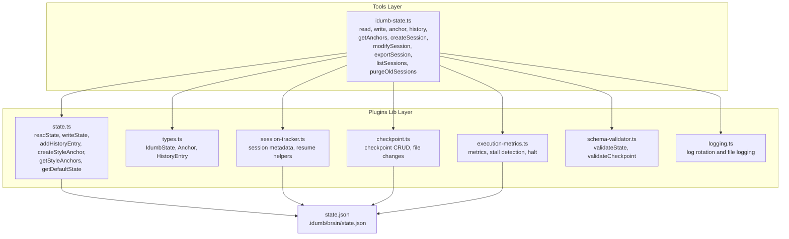
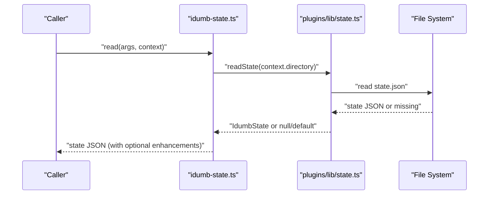
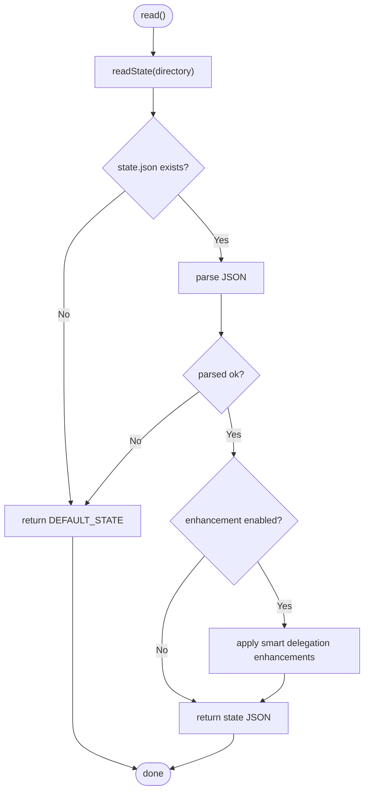
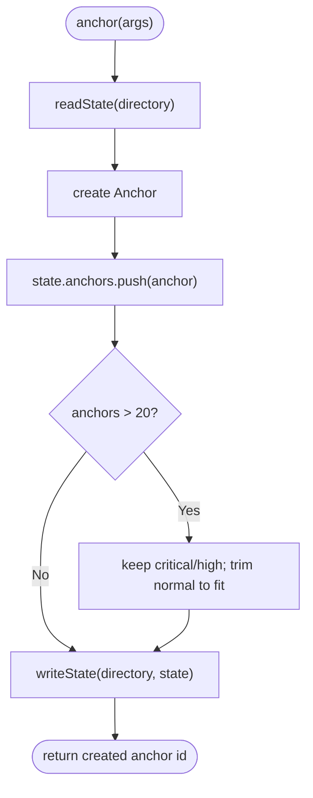
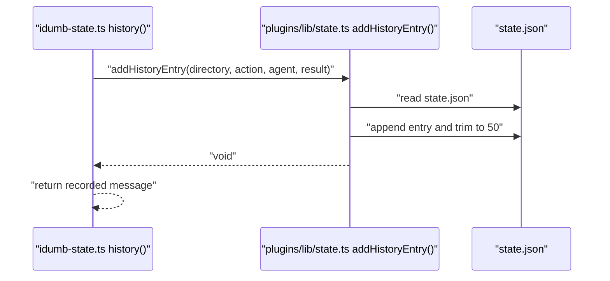
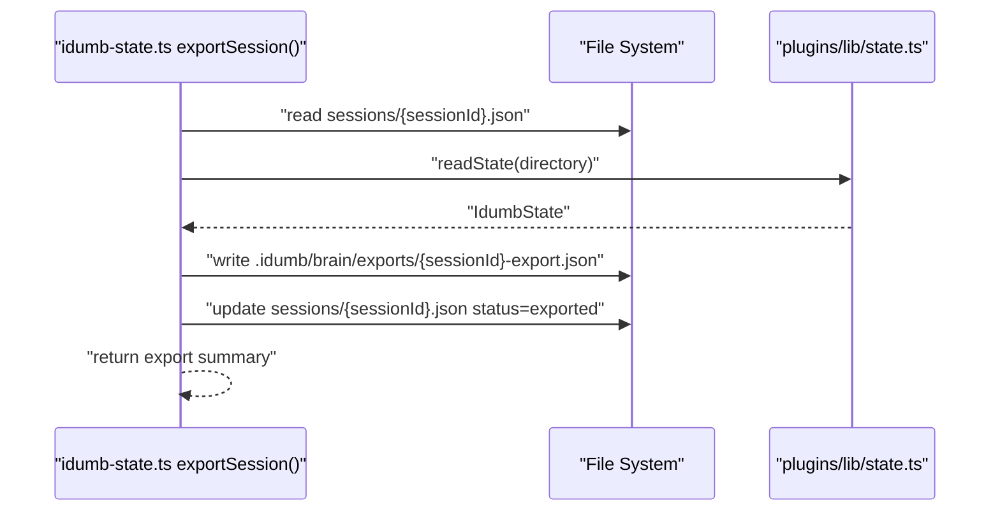
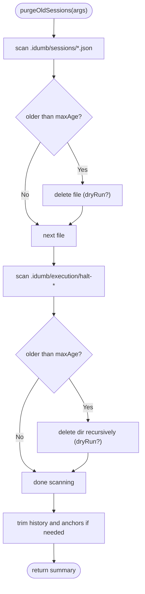
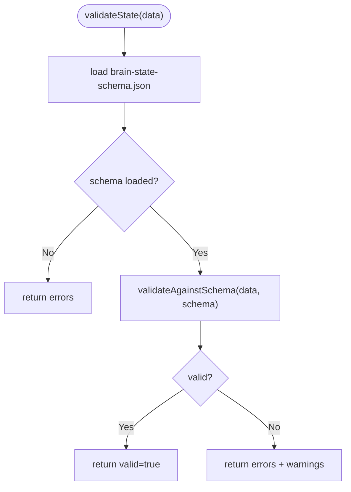
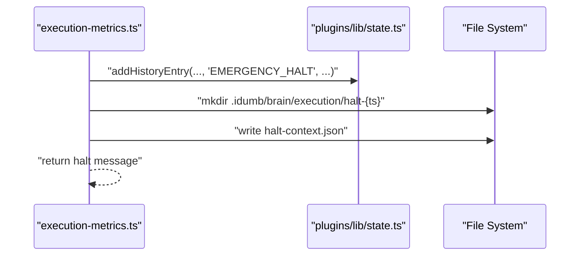
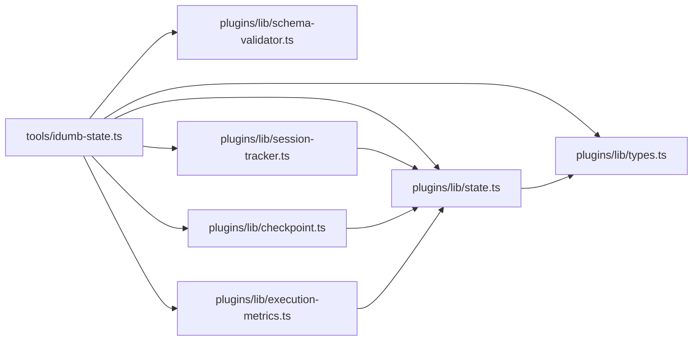

# State Operations

<cite>
**Referenced Files in This Document**
- [src/tools/idumb-state.ts](file://src/tools/idumb-state.ts)
- [src/plugins/lib/state.ts](file://src/plugins/lib/state.ts)
- [src/plugins/lib/types.ts](file://src/plugins/lib/types.ts)
- [src/schemas/brain-state-schema.json](file://src/schemas/brain-state-schema.json)
- [src/plugins/lib/session-tracker.ts](file://src/plugins/lib/session-tracker.ts)
- [src/plugins/lib/checkpoint.ts](file://src/plugins/lib/checkpoint.ts)
- [src/plugins/lib/execution-metrics.ts](file://src/plugins/lib/execution-metrics.ts)
- [src/plugins/lib/schema-validator.ts](file://src/plugins/lib/schema-validator.ts)
- [src/plugins/lib/logging.ts](file://src/plugins/lib/logging.ts)
- [src/templates/state.md](file://src/templates/state.md)
</cite>

## Table of Contents
1. [Introduction](#introduction)
2. [Project Structure](#project-structure)
3. [Core Components](#core-components)
4. [Architecture Overview](#architecture-overview)
5. [Detailed Component Analysis](#detailed-component-analysis)
6. [Dependency Analysis](#dependency-analysis)
7. [Performance Considerations](#performance-considerations)
8. [Troubleshooting Guide](#troubleshooting-guide)
9. [Conclusion](#conclusion)
10. [Appendices](#appendices)

## Introduction
This document describes iDumb’s state operation tools that manage governance state, anchors, history, and sessions. It covers read and write operations, anchor lifecycle and compaction survival, history recording and retrieval, session lifecycle and export, and garbage collection. It also includes validation, consistency checks, recovery procedures, debugging techniques, and best practices.

## Project Structure
The state operations span two layers:
- Tools layer: user-facing tools that expose state operations via a plugin tool interface.
- Plugins/lib layer: shared state utilities and types used across modules.

**Diagram sources**
- [src/tools/idumb-state.ts](file://src/tools/idumb-state.ts#L82-L595)
- [src/plugins/lib/state.ts](file://src/plugins/lib/state.ts#L34-L188)
- [src/plugins/lib/types.ts](file://src/plugins/lib/types.ts#L20-L51)
- [src/plugins/lib/session-tracker.ts](file://src/plugins/lib/session-tracker.ts#L204-L259)
- [src/plugins/lib/checkpoint.ts](file://src/plugins/lib/checkpoint.ts#L123-L204)
- [src/plugins/lib/execution-metrics.ts](file://src/plugins/lib/execution-metrics.ts#L30-L95)
- [src/plugins/lib/schema-validator.ts](file://src/plugins/lib/schema-validator.ts#L211-L227)
- [src/plugins/lib/logging.ts](file://src/plugins/lib/logging.ts#L89-L117)

**Section sources**
- [src/tools/idumb-state.ts](file://src/tools/idumb-state.ts#L1-L599)
- [src/plugins/lib/state.ts](file://src/plugins/lib/state.ts#L1-L189)
- [src/plugins/lib/types.ts](file://src/plugins/lib/types.ts#L1-L282)

## Core Components
- State read/write: robust JSON read/write with defaults and error handling.
- Anchor management: creation, prioritization, compaction survival, and retrieval.
- History recording: bounded history with automatic trimming.
- Session management: creation, updates, export, listing, and cleanup.
- Validation and schema: runtime validation against JSON Schema.
- Consistency and recovery: checkpointing, stall detection, and emergency halt.

**Section sources**
- [src/tools/idumb-state.ts](file://src/tools/idumb-state.ts#L62-L152)
- [src/tools/idumb-state.ts](file://src/tools/idumb-state.ts#L154-L248)
- [src/tools/idumb-state.ts](file://src/tools/idumb-state.ts#L194-L221)
- [src/tools/idumb-state.ts](file://src/tools/idumb-state.ts#L277-L474)
- [src/plugins/lib/schema-validator.ts](file://src/plugins/lib/schema-validator.ts#L211-L227)
- [src/plugins/lib/checkpoint.ts](file://src/plugins/lib/checkpoint.ts#L123-L204)
- [src/plugins/lib/execution-metrics.ts](file://src/plugins/lib/execution-metrics.ts#L307-L372)

## Architecture Overview
The state tooling follows a layered design:
- Tools layer exposes named tools for state operations.
- Lib layer encapsulates state persistence, types, and cross-cutting concerns.
- Schemas define validation contracts.
- Sessions and checkpoints integrate with state for lifecycle and recovery.

**Diagram sources**
- [src/tools/idumb-state.ts](file://src/tools/idumb-state.ts#L82-L130)
- [src/plugins/lib/state.ts](file://src/plugins/lib/state.ts#L34-L45)

**Section sources**
- [src/tools/idumb-state.ts](file://src/tools/idumb-state.ts#L82-L130)
- [src/plugins/lib/state.ts](file://src/plugins/lib/state.ts#L34-L73)

## Detailed Component Analysis

### State Read and Write
- Read:
  - Reads state.json from .idumb/brain/state.json.
  - Returns default state if file is missing or invalid.
  - Supports optional smart delegation enhancements and readable summaries.
- Write:
  - Updates selected fields (phase, framework, lastValidation, incrementValidation).
  - Writes atomically via ensureDirectory and writeState.

**Diagram sources**
- [src/tools/idumb-state.ts](file://src/tools/idumb-state.ts#L62-L130)
- [src/plugins/lib/state.ts](file://src/plugins/lib/state.ts#L34-L45)

**Section sources**
- [src/tools/idumb-state.ts](file://src/tools/idumb-state.ts#L62-L152)
- [src/plugins/lib/state.ts](file://src/plugins/lib/state.ts#L34-L73)

### Anchor Management
- Creation:
  - Adds an Anchor with id, created timestamp, type, content, and priority.
  - Enforces a cap of 20 anchors; trims oldest normal anchors first, preserves critical/high.
- Retrieval:
  - getAnchors filters by priority and formats for compaction injection.
- Compaction survival:
  - During compaction, critical and high anchors are preserved.

**Diagram sources**
- [src/tools/idumb-state.ts](file://src/tools/idumb-state.ts#L154-L192)
- [src/tools/idumb-state.ts](file://src/tools/idumb-state.ts#L224-L248)

**Section sources**
- [src/tools/idumb-state.ts](file://src/tools/idumb-state.ts#L154-L192)
- [src/tools/idumb-state.ts](file://src/tools/idumb-state.ts#L224-L248)

### History Recording and Retrieval
- Recording:
  - Adds a HistoryEntry with timestamp, action, agent, and result.
  - Automatically trims to last 50 entries.
- Retrieval:
  - Export and listing tools can include recent history entries.

**Diagram sources**
- [src/tools/idumb-state.ts](file://src/tools/idumb-state.ts#L194-L221)
- [src/plugins/lib/state.ts](file://src/plugins/lib/state.ts#L79-L101)

**Section sources**
- [src/tools/idumb-state.ts](file://src/tools/idumb-state.ts#L194-L221)
- [src/plugins/lib/state.ts](file://src/plugins/lib/state.ts#L79-L101)

### Session Management
- Create:
  - Ensures sessions directory, reads current state, creates a SessionRecord with metadata.
- Modify:
  - Loads session, merges status, summary, and metadata; updates timestamps.
- Export:
  - Builds export payload with anchors (critical/high) and recent history; marks session exported.
- List:
  - Lists tracked sessions, sorts by updatedAt, summarizes counts by status.

**Diagram sources**
- [src/tools/idumb-state.ts](file://src/tools/idumb-state.ts#L369-L430)
- [src/plugins/lib/state.ts](file://src/plugins/lib/state.ts#L34-L45)

**Section sources**
- [src/tools/idumb-state.ts](file://src/tools/idumb-state.ts#L277-L474)
- [src/tools/idumb-state.ts](file://src/tools/idumb-state.ts#L369-L430)

### Garbage Collection and Cleanup
- Purge old sessions and halt checkpoints:
  - Deletes session files older than maxAgeHours (default 168 hours).
  - Removes old halt-* directories.
  - Trims state history and anchors to configured caps.

**Diagram sources**
- [src/tools/idumb-state.ts](file://src/tools/idumb-state.ts#L481-L595)

**Section sources**
- [src/tools/idumb-state.ts](file://src/tools/idumb-state.ts#L481-L595)

### Validation and Consistency Checks
- JSON Schema validation:
  - validateState validates against brain-state-schema.json.
  - validateCheckpoint validates against checkpoint-schema.json.
- Schema constraints:
  - Anchors capped at 20; History capped at 50.
  - Anchor content length and types constrained.
  - Enumerations enforced for framework, result, and anchor types.

**Diagram sources**
- [src/plugins/lib/schema-validator.ts](file://src/plugins/lib/schema-validator.ts#L211-L227)
- [src/schemas/brain-state-schema.json](file://src/schemas/brain-state-schema.json#L1-L112)

**Section sources**
- [src/plugins/lib/schema-validator.ts](file://src/plugins/lib/schema-validator.ts#L211-L227)
- [src/schemas/brain-state-schema.json](file://src/schemas/brain-state-schema.json#L37-L52)

### Recovery Procedures
- Checkpointing:
  - createCheckpoint captures state, git hash, file changes, anchors, and metrics.
  - loadCheckpoint retrieves and marks checkpoints stale if older than threshold.
- Emergency halt:
  - triggerEmergencyHalt logs to history, writes halt context, and returns guidance.

**Diagram sources**
- [src/plugins/lib/execution-metrics.ts](file://src/plugins/lib/execution-metrics.ts#L307-L372)
- [src/plugins/lib/checkpoint.ts](file://src/plugins/lib/checkpoint.ts#L123-L204)

**Section sources**
- [src/plugins/lib/checkpoint.ts](file://src/plugins/lib/checkpoint.ts#L123-L204)
- [src/plugins/lib/execution-metrics.ts](file://src/plugins/lib/execution-metrics.ts#L307-L372)

## Dependency Analysis
- Tools depend on lib state utilities for read/write and on schema-validator for validation.
- Session tracker and checkpoint utilities depend on state for context and on logging for audit trails.
- Types are centralized in types.ts to avoid duplication.

**Diagram sources**
- [src/tools/idumb-state.ts](file://src/tools/idumb-state.ts#L1-L50)
- [src/plugins/lib/state.ts](file://src/plugins/lib/state.ts#L1-L20)
- [src/plugins/lib/types.ts](file://src/plugins/lib/types.ts#L20-L51)
- [src/plugins/lib/schema-validator.ts](file://src/plugins/lib/schema-validator.ts#L1-L20)
- [src/plugins/lib/session-tracker.ts](file://src/plugins/lib/session-tracker.ts#L10-L20)
- [src/plugins/lib/checkpoint.ts](file://src/plugins/lib/checkpoint.ts#L10-L15)
- [src/plugins/lib/execution-metrics.ts](file://src/plugins/lib/execution-metrics.ts#L9-L14)

**Section sources**
- [src/tools/idumb-state.ts](file://src/tools/idumb-state.ts#L1-L50)
- [src/plugins/lib/state.ts](file://src/plugins/lib/state.ts#L1-L20)
- [src/plugins/lib/types.ts](file://src/plugins/lib/types.ts#L20-L51)

## Performance Considerations
- Atomic writes: writeState uses a temp-file + rename pattern to reduce corruption risk.
- Bounded collections: anchors and history are trimmed to fixed sizes to control memory and I/O.
- Log rotation: plugin logging rotates archives to prevent unbounded growth.
- Dry-run purging: purgeOldSessions supports dry-run to preview deletions before applying.

[No sources needed since this section provides general guidance]

## Troubleshooting Guide
Common issues and resolutions:
- State file missing or corrupted:
  - Behavior: read returns default state; write ensures directory and persists safely.
  - Action: inspect .idumb/brain/state.json; use validateState to diagnose.
- Excessive history or anchors:
  - Behavior: automatic trimming to 50 history entries and 20 anchors.
  - Action: export sessions to preserve critical context; review purge policies.
- Session not found:
  - Behavior: modifySession returns error; exportSession handles missing session records gracefully.
  - Action: verify sessionId; listSessions to confirm presence.
- Validation failures:
  - Behavior: schema-validator reports missing required fields, wrong types, or out-of-range values.
  - Action: fix fields per schema; re-run validation.
- Emergency halt:
  - Behavior: halt context saved; guidance returned.
  - Action: review halt-context.json; run /idumb:validate; consider recovery steps.

**Section sources**
- [src/plugins/lib/state.ts](file://src/plugins/lib/state.ts#L34-L73)
- [src/plugins/lib/schema-validator.ts](file://src/plugins/lib/schema-validator.ts#L211-L227)
- [src/tools/idumb-state.ts](file://src/tools/idumb-state.ts#L315-L366)
- [src/tools/idumb-state.ts](file://src/tools/idumb-state.ts#L369-L430)
- [src/plugins/lib/execution-metrics.ts](file://src/plugins/lib/execution-metrics.ts#L307-L372)

## Conclusion
iDumb’s state operation tools provide a robust, validated, and recoverable foundation for governance state, anchors, history, and sessions. They enforce consistency via schemas, cap growth, and offer recovery pathways through checkpoints and emergency halts. Integrators should leverage validation, adhere to schema constraints, and use sessions and exports for long-term continuity.

[No sources needed since this section summarizes without analyzing specific files]

## Appendices

### API Reference: State Tools
- read
  - Purpose: Read current state with optional enhancements and readable summaries.
  - Parameters: includeContext, readableFormat, autoEnhance.
  - Returns: JSON string of state (optionally enhanced).
- write
  - Purpose: Update state fields.
  - Parameters: phase, framework, lastValidation, incrementValidation.
  - Returns: Confirmation with updated state.
- anchor
  - Purpose: Add an anchor with priority and type.
  - Parameters: type, content, priority.
  - Returns: Created anchor id.
- history
  - Purpose: Record an action with result.
  - Parameters: action, result.
  - Returns: Confirmation with recorded action.
- getAnchors
  - Purpose: Retrieve anchors for compaction injection.
  - Parameters: priorityFilter.
  - Returns: Formatted anchors for injection.
- createSession
  - Purpose: Create a session record.
  - Parameters: sessionId, phase, metadata.
  - Returns: Created session JSON.
- modifySession
  - Purpose: Update session status, summary, and metadata.
  - Parameters: sessionId, status, summary, metadata.
  - Returns: Updated session JSON or error.
- exportSession
  - Purpose: Export session context and state for long-term storage.
  - Parameters: sessionId, includeHistory, includeAnchors.
  - Returns: Export summary with paths and counts.
- listSessions
  - Purpose: List tracked sessions with status summary.
  - Parameters: status.
  - Returns: Sessions array, count, and summary.
- purgeOldSessions
  - Purpose: Clean up old session files and halt checkpoints.
  - Parameters: maxAgeHours, dryRun.
  - Returns: Summary of deletions and errors.

**Section sources**
- [src/tools/idumb-state.ts](file://src/tools/idumb-state.ts#L82-L595)

### Best Practices
- Always validate state post-write using validateState.
- Use anchor priorities to ensure critical context survives compaction.
- Regularly export sessions to preserve context and history.
- Monitor plugin logs for audit trails; rely on log rotation to manage size.
- Use purgeOldSessions periodically to reclaim space; prefer dry-run first.

**Section sources**
- [src/plugins/lib/schema-validator.ts](file://src/plugins/lib/schema-validator.ts#L211-L227)
- [src/plugins/lib/logging.ts](file://src/plugins/lib/logging.ts#L89-L117)
- [src/tools/idumb-state.ts](file://src/tools/idumb-state.ts#L481-L595)