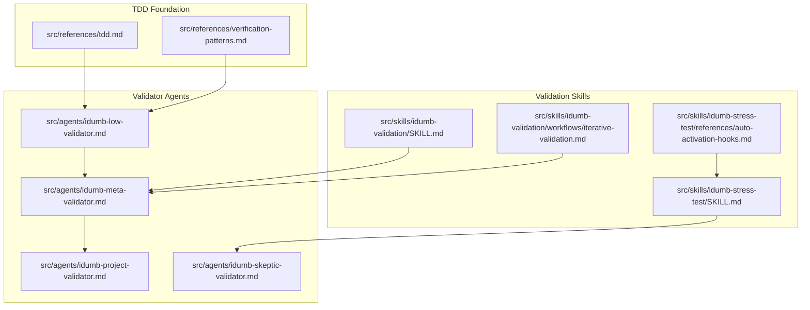
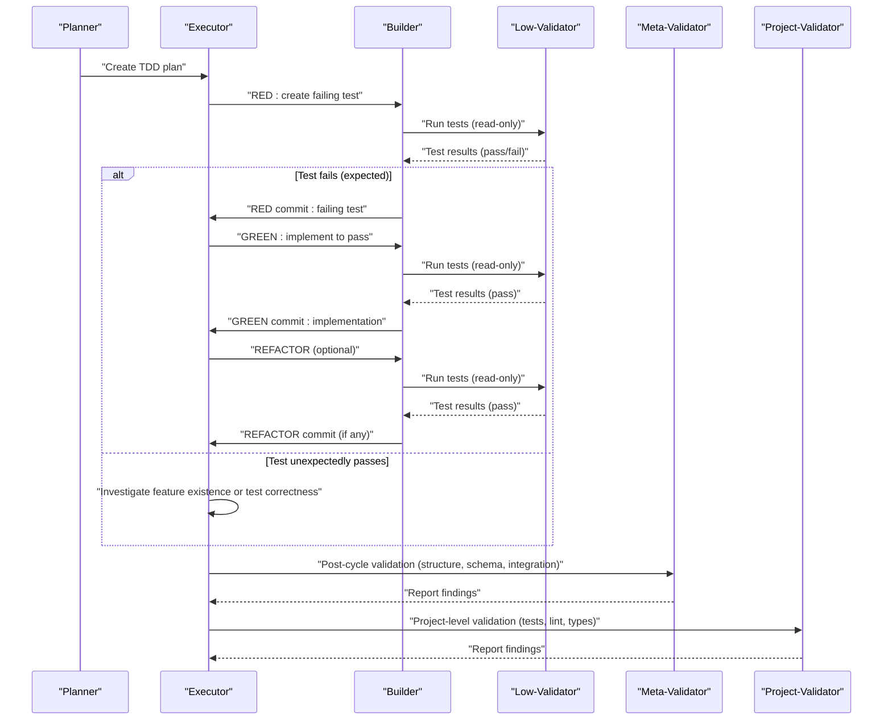
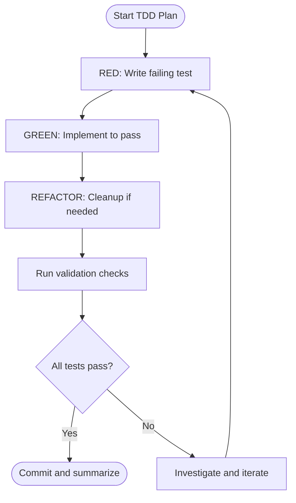
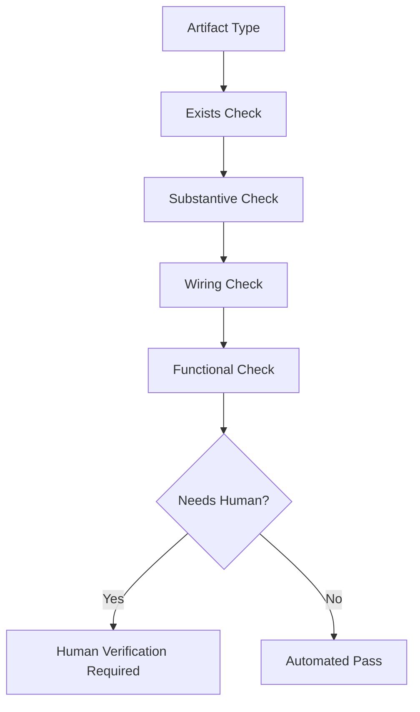
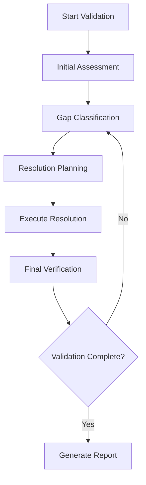
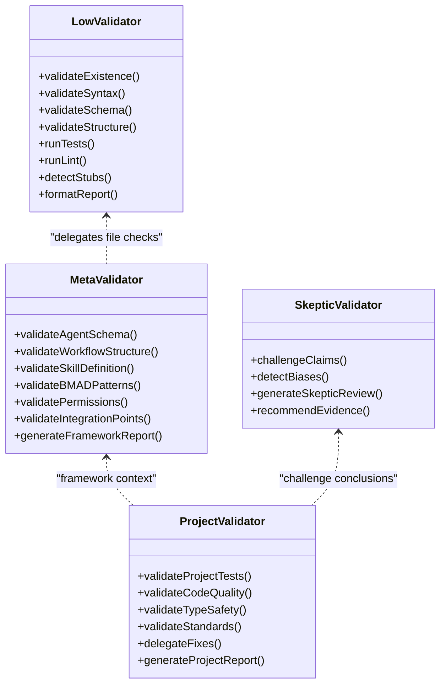
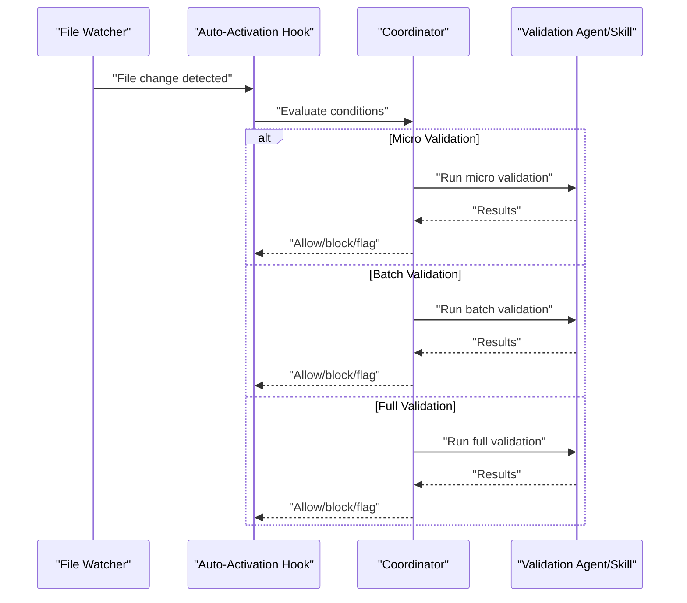
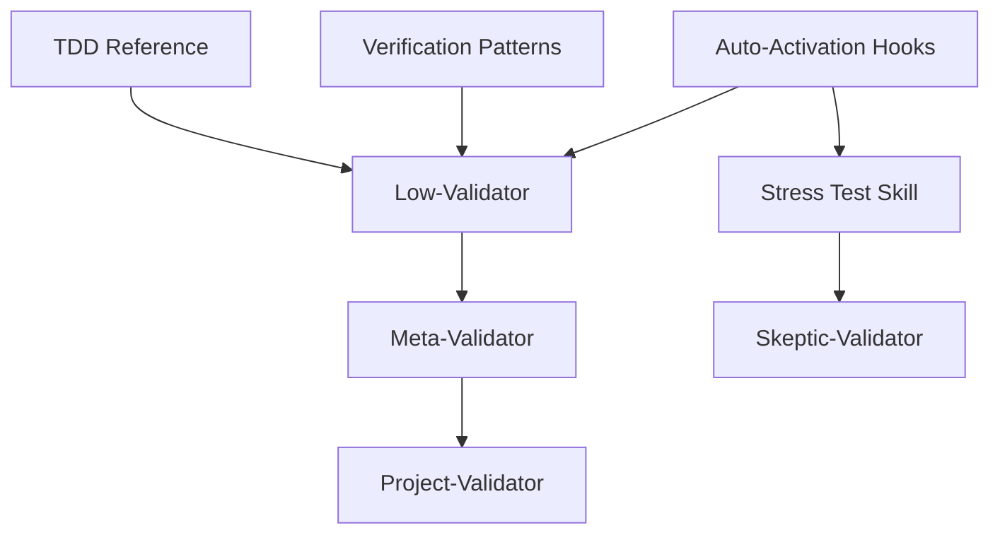

# Test-Driven Development Practices

<cite>
**Referenced Files in This Document**
- [tdd.md](file://src/references/tdd.md)
- [verification-patterns.md](file://src/references/verification-patterns.md)
- [idumb-validation/SKILL.md](file://src/skills/idumb-validation/SKILL.md)
- [iterative-validation.md](file://src/skills/idumb-validation/workflows/iterative-validation.md)
- [idumb-stress-test/SKILL.md](file://src/skills/idumb-stress-test/SKILL.md)
- [auto-activation-hooks.md](file://src/skills/idumb-stress-test/references/auto-activation-hooks.md)
- [idumb-low-validator.md](file://src/agents/idumb-low-validator.md)
- [idumb-meta-validator.md](file://src/agents/idumb-meta-validator.md)
- [idumb-project-validator.md](file://src/agents/idumb-project-validator.md)
- [idumb-skeptic-validator.md](file://src/agents/idumb-skeptic-validator.md)
</cite>

## Table of Contents
1. [Introduction](#introduction)
2. [Project Structure](#project-structure)
3. [Core Components](#core-components)
4. [Architecture Overview](#architecture-overview)
5. [Detailed Component Analysis](#detailed-component-analysis)
6. [Dependency Analysis](#dependency-analysis)
7. [Performance Considerations](#performance-considerations)
8. [Troubleshooting Guide](#troubleshooting-guide)
9. [Conclusion](#conclusion)

## Introduction
This document establishes comprehensive Test-Driven Development (TDD) practices for the iDumb framework. It maps TDD red-green-refactor cycles to iDumb's agent-driven validation pipeline, detailing how tests drive implementation quality and how verification patterns ensure robust agent, tool, and workflow development. The guide covers writing effective tests across artifact types, integration testing protocols, continuous validation workflows, multi-agent permission enforcement, state management validation, and quality gates in the development pipeline.

## Project Structure
The iDumb repository organizes TDD and validation resources across three primary areas:
- TDD methodology and execution flow
- Verification patterns for artifacts and wiring
- Validation skills and agents implementing structured checks

**Diagram sources**
- [tdd.md](file://src/references/tdd.md#L1-L282)
- [verification-patterns.md](file://src/references/verification-patterns.md#L1-L601)
- [idumb-validation/SKILL.md](file://src/skills/idumb-validation/SKILL.md#L1-L720)
- [iterative-validation.md](file://src/skills/idumb-validation/workflows/iterative-validation.md#L1-L236)
- [idumb-stress-test/SKILL.md](file://src/skills/idumb-stress-test/SKILL.md#L1-L704)
- [auto-activation-hooks.md](file://src/skills/idumb-stress-test/references/auto-activation-hooks.md#L1-L329)
- [idumb-low-validator.md](file://src/agents/idumb-low-validator.md#L1-L865)
- [idumb-meta-validator.md](file://src/agents/idumb-meta-validator.md#L1-L722)
- [idumb-project-validator.md](file://src/agents/idumb-project-validator.md#L1-L130)
- [idumb-skeptic-validator.md](file://src/agents/idumb-skeptic-validator.md#L1-L1080)

**Section sources**
- [tdd.md](file://src/references/tdd.md#L1-L282)
- [verification-patterns.md](file://src/references/verification-patterns.md#L1-L601)

## Core Components
- TDD Reference: Defines when to use TDD, plan structure, red-green-refactor cycle, test quality principles, framework setup, error handling, commit patterns, and context budget.
- Verification Patterns: Establishes the four-level verification hierarchy (exists, substantive, wired, functional) and artifact-specific validation patterns.
- Validation Skills: Provide iterative gap detection, resolution, and verification workflows with stall detection and escalation.
- Stress Test Skill: Implements micro/batch/full validation modes, integration matrices, regression sweeps, and self-healing protocols.
- Validator Agents: Implement read-only checks, schema validation, wiring verification, and structured reporting.

**Section sources**
- [tdd.md](file://src/references/tdd.md#L43-L133)
- [verification-patterns.md](file://src/references/verification-patterns.md#L18-L33)
- [idumb-validation/SKILL.md](file://src/skills/idumb-validation/SKILL.md#L89-L116)
- [idumb-stress-test/SKILL.md](file://src/skills/idumb-stress-test/SKILL.md#L36-L109)
- [idumb-low-validator.md](file://src/agents/idumb-low-validator.md#L48-L74)

## Architecture Overview
The iDumb TDD architecture integrates test execution with automated validation agents and skills. The red-green-refactor cycle is orchestrated by agents and skills, with low-level validation handled by read-only validators and higher-level validation managed by meta and project validators.

**Diagram sources**
- [tdd.md](file://src/references/tdd.md#L100-L133)
- [idumb-low-validator.md](file://src/agents/idumb-low-validator.md#L48-L74)
- [idumb-meta-validator.md](file://src/agents/idumb-meta-validator.md#L50-L70)
- [idumb-project-validator.md](file://src/agents/idumb-project-validator.md#L47-L51)

## Detailed Component Analysis

### TDD Methodology and Red-Green-Refactor Cycle
- When to use TDD: Prefer TDD for features with defined inputs/outputs, API endpoints, data transformations, validation rules, algorithms, state machines, and workflows.
- TDD Plan Structure: One feature per plan; includes objective, context, feature behavior, implementation notes, verification command, success criteria, and output summary.
- Execution Flow: RED (failing test), GREEN (minimal implementation), REFACTOR (cleanup if needed); each phase produces atomic commits.
- Test Quality: Tests should verify behavior, not implementation; one concept per test; descriptive names; avoid implementation details.
- Framework Setup: Detect project type, install minimal test framework, configure if needed, verify setup, and create first test file.
- Error Handling: If tests unexpectedly pass/fail or refactor breaks tests, escalate and debug; iDumb agents handle escalation.

**Diagram sources**
- [tdd.md](file://src/references/tdd.md#L100-L133)
- [tdd.md](file://src/references/tdd.md#L135-L154)
- [tdd.md](file://src/references/tdd.md#L156-L206)
- [tdd.md](file://src/references/tdd.md#L208-L234)

**Section sources**
- [tdd.md](file://src/references/tdd.md#L18-L41)
- [tdd.md](file://src/references/tdd.md#L43-L98)
- [tdd.md](file://src/references/tdd.md#L100-L133)
- [tdd.md](file://src/references/tdd.md#L135-L154)
- [tdd.md](file://src/references/tdd.md#L156-L206)
- [tdd.md](file://src/references/tdd.md#L208-L234)

### Verification Patterns and Artifact Validation
- Four-Level Hierarchy: Exists, Substantive, Wired, Functional; validated by specialized agents and skills.
- Stub Detection: Comment-based stubs, placeholder text, empty/trivial implementations, hardcoded values.
- React Components: Existence, substantive checks, wiring, and functional verification.
- API Routes: Existence, substantive checks, wiring, and functional verification.
- Database Schemas: Existence, substantive checks, and migration status.
- TypeScript Tools: Existence, substantive checks, wiring, and tool usage.
- Agent Profiles: Existence, 4-field persona validation, and wiring.
- Wiring Verification: Component-API, API-Database, Agent-Tool, Command-Agent patterns.
- Automated Verification Script: Existence, stubs, wiring, substantive checks, and agent persona validation.
- Human Verification Triggers: Visual appearance, user flows, real-time behavior, external integrations, error clarity, performance feel.

**Diagram sources**
- [verification-patterns.md](file://src/references/verification-patterns.md#L18-L33)
- [verification-patterns.md](file://src/references/verification-patterns.md#L35-L73)
- [verification-patterns.md](file://src/references/verification-patterns.md#L75-L131)
- [verification-patterns.md](file://src/references/verification-patterns.md#L133-L198)
- [verification-patterns.md](file://src/references/verification-patterns.md#L200-L255)
- [verification-patterns.md](file://src/references/verification-patterns.md#L257-L291)
- [verification-patterns.md](file://src/references/verification-patterns.md#L293-L347)
- [verification-patterns.md](file://src/references/verification-patterns.md#L349-L409)
- [verification-patterns.md](file://src/references/verification-patterns.md#L464-L511)
- [verification-patterns.md](file://src/references/verification-patterns.md#L513-L549)
- [verification-patterns.md](file://src/references/verification-patterns.md#L551-L601)

**Section sources**
- [verification-patterns.md](file://src/references/verification-patterns.md#L5-L16)
- [verification-patterns.md](file://src/references/verification-patterns.md#L35-L73)
- [verification-patterns.md](file://src/references/verification-patterns.md#L464-L511)

### Validation Skills: Iterative Gap Detection and Self-Healing
- Three-Layer Validation Model: Structure, Integration, Behavior.
- Validation Lifecycle: Detect → Assess → Resolve → Verify; iterative until PASS.
- Integration Point Thresholds: Highest (agents/workflows/core governance: 30+), Middle (tools/commands/templates: 15+), Lowest (individual artifacts/configs: 10+).
- Iterative Gap Detection Workflow: Initial scan → Gap classification → Resolution planning → Execute resolution → Final verification with stall detection and escalation.
- Stress Test Skill: Micro (real-time), Batch (phase transitions), Full (comprehensive) validation modes; agent coordination, integration matrices, regression sweeps, conflict detection, gap detection, and self-healing.

**Diagram sources**
- [idumb-validation/SKILL.md](file://src/skills/idumb-validation/SKILL.md#L72-L116)
- [idumb-validation/SKILL.md](file://src/skills/idumb-validation/SKILL.md#L450-L560)
- [iterative-validation.md](file://src/skills/idumb-validation/workflows/iterative-validation.md#L1-L236)
- [idumb-stress-test/SKILL.md](file://src/skills/idumb-stress-test/SKILL.md#L113-L109)

**Section sources**
- [idumb-validation/SKILL.md](file://src/skills/idumb-validation/SKILL.md#L48-L68)
- [idumb-validation/SKILL.md](file://src/skills/idumb-validation/SKILL.md#L450-L560)
- [iterative-validation.md](file://src/skills/idumb-validation/workflows/iterative-validation.md#L145-L213)
- [idumb-stress-test/SKILL.md](file://src/skills/idumb-stress-test/SKILL.md#L23-L32)

### Validator Agents: Read-Only Validation and Structured Reporting
- Low-Validator: Performs read-only checks (existence, syntax, schema, structure, tests, lint, stubs) and returns structured reports.
- Meta-Validator: Validates framework artifacts (agent schemas, workflow structures, skill definitions, BMAD patterns, permissions, integration points).
- Project-Validator: Validates project code quality, tests, and standards; delegates fixes to project-executor.
- Skeptic-Validator: Challenges assumptions and conclusions to prevent confirmation bias; generates structured skeptic reviews.

**Diagram sources**
- [idumb-low-validator.md](file://src/agents/idumb-low-validator.md#L178-L412)
- [idumb-meta-validator.md](file://src/agents/idumb-meta-validator.md#L128-L330)
- [idumb-project-validator.md](file://src/agents/idumb-project-validator.md#L62-L86)
- [idumb-skeptic-validator.md](file://src/agents/idumb-skeptic-validator.md#L126-L253)

**Section sources**
- [idumb-low-validator.md](file://src/agents/idumb-low-validator.md#L48-L74)
- [idumb-meta-validator.md](file://src/agents/idumb-meta-validator.md#L50-L70)
- [idumb-project-validator.md](file://src/agents/idumb-project-validator.md#L47-L51)
- [idumb-skeptic-validator.md](file://src/agents/idumb-skeptic-validator.md#L36-L58)

### Continuous Validation and Auto-Activation Hooks
- Auto-Activation Hooks: Session hooks, file event hooks, phase transition hooks, command execution hooks, and agent spawning hooks.
- Coordinator Decision Matrix: Determines micro, batch, or full validation based on conditions; non-blocking behavior with user overrides.
- Validation Scheduler: Debounce, priority queues, and concurrency controls.
- Integration with Continuous Validation: Hooks trigger continuous validation workflows; results feed back to hooks for blocking or warning actions.

**Diagram sources**
- [auto-activation-hooks.md](file://src/skills/idumb-stress-test/references/auto-activation-hooks.md#L13-L83)
- [auto-activation-hooks.md](file://src/skills/idumb-stress-test/references/auto-activation-hooks.md#L131-L165)
- [auto-activation-hooks.md](file://src/skills/idumb-stress-test/references/auto-activation-hooks.md#L205-L245)

**Section sources**
- [auto-activation-hooks.md](file://src/skills/idumb-stress-test/references/auto-activation-hooks.md#L13-L83)
- [auto-activation-hooks.md](file://src/skills/idumb-stress-test/references/auto-activation-hooks.md#L131-L165)
- [auto-activation-hooks.md](file://src/skills/idumb-stress-test/references/auto-activation-hooks.md#L205-L245)

## Dependency Analysis
The TDD and validation ecosystem exhibits layered dependencies:
- TDD Reference informs the red-green-refactor cycle and commit patterns.
- Verification Patterns provide the criteria for validating artifacts across levels.
- Validation Skills depend on Validator Agents for execution and reporting.
- Auto-Activation Hooks coordinate continuous validation across the development lifecycle.

**Diagram sources**
- [tdd.md](file://src/references/tdd.md#L1-L282)
- [verification-patterns.md](file://src/references/verification-patterns.md#L1-L601)
- [idumb-low-validator.md](file://src/agents/idumb-low-validator.md#L1-L865)
- [idumb-meta-validator.md](file://src/agents/idumb-meta-validator.md#L1-L722)
- [idumb-project-validator.md](file://src/agents/idumb-project-validator.md#L1-L130)
- [idumb-stress-test/SKILL.md](file://src/skills/idumb-stress-test/SKILL.md#L1-L704)
- [auto-activation-hooks.md](file://src/skills/idumb-stress-test/references/auto-activation-hooks.md#L1-L329)

**Section sources**
- [tdd.md](file://src/references/tdd.md#L1-L282)
- [verification-patterns.md](file://src/references/verification-patterns.md#L1-L601)
- [idumb-stress-test/SKILL.md](file://src/skills/idumb-stress-test/SKILL.md#L1-L704)

## Performance Considerations
- Context Budget: TDD plans target ~40% context usage due to back-and-forth nature of red-green-refactor cycles.
- Validation Modes: Micro (<5s), Batch (<60s), Full (<5min) to balance thoroughness and speed.
- Concurrency Controls: Single validation at a time with debouncing and prioritization to avoid overload.
- Evidence-Based Reporting: Structured reports minimize ambiguity and reduce rework.

[No sources needed since this section provides general guidance]

## Troubleshooting Guide
- Unexpected Test Results:
  - If a test unexpectedly passes in RED phase, investigate whether the feature already exists or the test is incorrect.
  - If a test fails in GREEN phase, debug the implementation; do not skip to refactor.
  - If tests fail in REFACTOR phase, undo changes and refactor in smaller steps.
- Unrelated Tests Breaking: Stop and investigate potential coupling; fix before proceeding.
- iDumb Escalation: Persistent failures escalate to Debugger for root cause analysis.
- Low-Validator Limitations: Read-only contract; cannot modify files, delegate, or write state.
- Meta-Validator Scope: Framework-level validation; delegates file-level checks to Low-Validator.
- Project-Validator Scope: Project code only; delegates fixes to Project-Executor.
- Skeptic-Validator Bias Detection: Systematic detection of confirmation bias, availability bias, authority bias, sunk cost bias, survivorship bias, and anchoring bias.

**Section sources**
- [tdd.md](file://src/references/tdd.md#L208-L234)
- [idumb-low-validator.md](file://src/agents/idumb-low-validator.md#L76-L126)
- [idumb-meta-validator.md](file://src/agents/idumb-meta-validator.md#L62-L63)
- [idumb-project-validator.md](file://src/agents/idumb-project-validator.md#L53-L61)
- [idumb-skeptic-validator.md](file://src/agents/idumb-skeptic-validator.md#L366-L522)

## Conclusion
iDumb’s TDD practices integrate tightly with automated validation agents and skills, ensuring that tests drive implementation quality across agents, tools, and workflows. The red-green-refactor cycle, combined with structured verification patterns and continuous validation hooks, creates robust quality gates. Multi-agent permission enforcement, state management validation, and self-healing protocols further strengthen the development pipeline, enabling reliable, iterative improvements with strong evidence-based reporting.