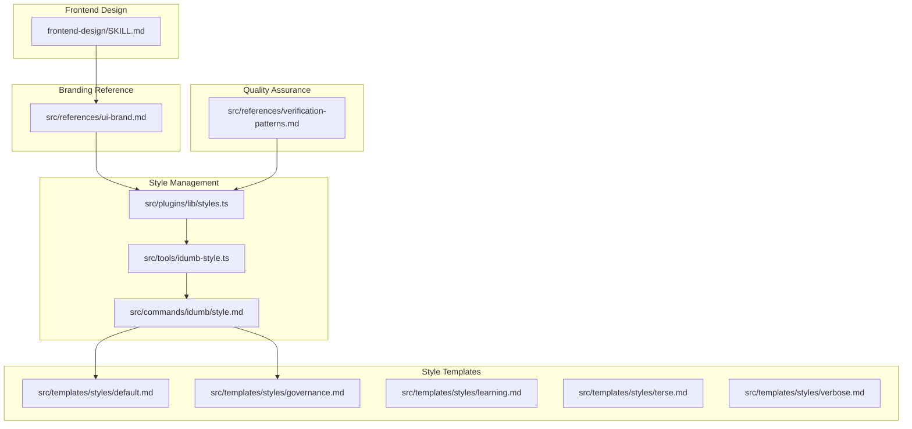
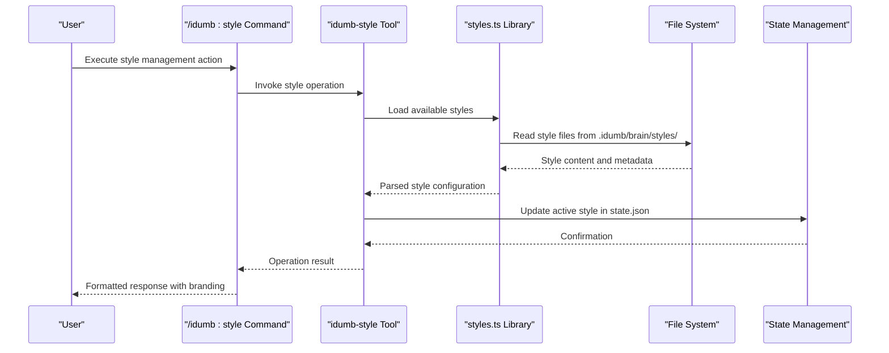
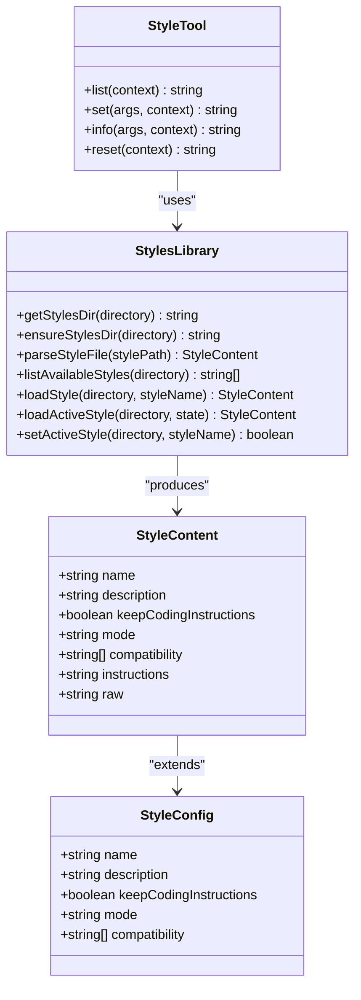
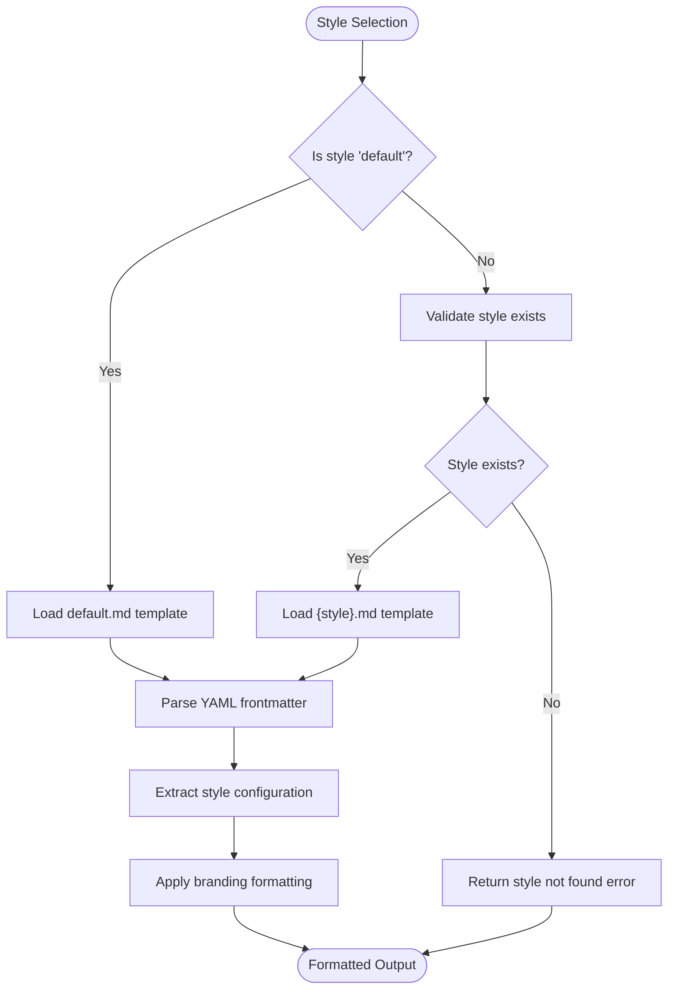
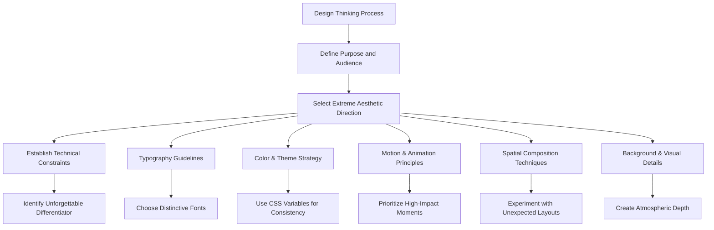
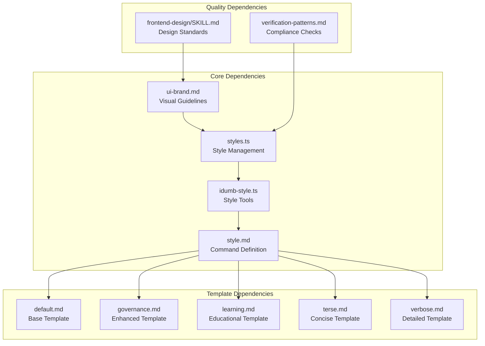

# UI Branding Standards

<cite>
**Referenced Files in This Document**
- [ui-brand.md](file://src/references/ui-brand.md)
- [styles.ts](file://src/plugins/lib/styles.ts)
- [idumb-style.ts](file://src/tools/idumb-style.ts)
- [style.md](file://src/commands/idumb/style.md)
- [default.md](file://src/templates/styles/default.md)
- [governance.md](file://src/templates/styles/governance.md)
- [SKILL.md](file://.agents/skills/frontend-design/SKILL.md)
- [verification-patterns.md](file://src/references/verification-patterns.md)
</cite>

## Table of Contents
1. [Introduction](#introduction)
2. [Project Structure](#project-structure)
3. [Core Components](#core-components)
4. [Architecture Overview](#architecture-overview)
5. [Detailed Component Analysis](#detailed-component-analysis)
6. [Dependency Analysis](#dependency-analysis)
7. [Performance Considerations](#performance-considerations)
8. [Accessibility and Responsive Design](#accessibility-and-responsive-design)
9. [Cross-Platform Consistency](#cross-platform-consistency)
10. [Brand Adaptation Guidelines](#brand-adaptation-guidelines)
11. [Component Library Standards](#component-library-standards)
12. [Design System Implementation](#design-system-implementation)
13. [Brand Compliance and Quality Assurance](#brand-compliance-and-quality-assurance)
14. [Visual Regression Testing](#visual-regression-testing)
15. [Maintenance and Updates](#maintenance-and-updates)
16. [Troubleshooting Guide](#troubleshooting-guide)
17. [Conclusion](#conclusion)

## Introduction
This document establishes comprehensive UI branding standards for maintaining visual consistency across iDumb applications. It defines brand guidelines including color schemes, typography, spacing, and visual elements that ensure a cohesive user experience. The document explains the relationship between branding standards and component design patterns, detailing how brand elements integrate into React components and UI patterns. It also covers accessibility standards, responsive design requirements, and cross-platform consistency measures. Additionally, it provides guidelines for brand adaptation in different contexts, component library standards, design system implementation, brand compliance checking, visual regression testing, and maintenance of brand integrity across updates and modifications.

## Project Structure
The iDumb project organizes branding and style management through dedicated reference materials, plugin libraries, tools, and templates. The structure ensures separation of concerns while enabling consistent enforcement of brand guidelines across different components and workflows.

**Diagram sources**
- [ui-brand.md](file://src/references/ui-brand.md#L1-L300)
- [styles.ts](file://src/plugins/lib/styles.ts#L1-L179)
- [idumb-style.ts](file://src/tools/idumb-style.ts#L1-L196)
- [style.md](file://src/commands/idumb/style.md#L1-L170)
- [default.md](file://src/templates/styles/default.md#L1-L12)
- [governance.md](file://src/templates/styles/governance.md#L1-L48)
- [SKILL.md](file://.agents/skills/frontend-design/SKILL.md#L1-L34)
- [verification-patterns.md](file://src/references/verification-patterns.md#L49-L95)

**Section sources**
- [ui-brand.md](file://src/references/ui-brand.md#L1-L300)
- [styles.ts](file://src/plugins/lib/styles.ts#L1-L179)
- [idumb-style.ts](file://src/tools/idumb-style.ts#L1-L196)
- [style.md](file://src/commands/idumb/style.md#L1-L170)
- [default.md](file://src/templates/styles/default.md#L1-L12)
- [governance.md](file://src/templates/styles/governance.md#L1-L48)
- [SKILL.md](file://.agents/skills/frontend-design/SKILL.md#L1-L34)
- [verification-patterns.md](file://src/references/verification-patterns.md#L49-L95)

## Core Components
This section outlines the fundamental building blocks of iDumb's UI branding system, focusing on visual identity, formatting guidelines, and style management mechanisms.

### Visual Identity Elements
- Framework Name: iDumb (Intelligent Delegation Using Managed Boundaries)
- Prefix: `idumb:` for commands, `idumb-` for agents/tools
- Symbol: ► (right pointer for flow/progress)
- Box Style: Double-line for checkpoints, single-line for status

### Stage Banners
Stage banners clearly mark workflow stage transitions using a standardized format:
- Format: `━━━ iDumb ► {ACTION} {CONTEXT} ━━━`
- Actions include: RESEARCHING, PLANNING, EXECUTING, VERIFYING, VALIDATING, DELEGATING, CHECKPOINT, COMPLETED

### Status Symbols
A comprehensive set of status symbols communicates task states and progress:
- ✓ Completed, ✗ Failed, ○ Pending, ● In progress, ◐ Partial, ⚠ Warning, 🔒 Blocked, → Next, ► Active/Current, ▸ Bullet

### Progress Display
Progress displays provide structured feedback on wave execution and phase summaries:
- Wave progress includes task lists with completion indicators
- Phase summary boxes present status, task counts, duration, and governance metrics

### Delegation Display
Delegation workflows use standardized messaging for agent spawning and return:
- Agent spawn messages indicate task context and token usage
- Agent return messages show result status, output summary, and timing

### Error Display
Error handling employs distinct visual treatments for recoverable and blocking errors:
- Recoverable errors include retry attempts and warning indicators
- Blocking errors use prominent box formatting with actionable options

### Governance Display
Governance reporting follows structured formats for validation results and permission checks:
- Validation reports include scope, checked items, pass/fail statistics, and issue listings
- Permission checks specify agent roles, attempted actions, and required permissions

**Section sources**
- [ui-brand.md](file://src/references/ui-brand.md#L1-L300)

## Architecture Overview
The iDumb branding architecture integrates visual guidelines with programmable style management, ensuring consistent enforcement across different components and contexts.

**Diagram sources**
- [style.md](file://src/commands/idumb/style.md#L1-L170)
- [idumb-style.ts](file://src/tools/idumb-style.ts#L1-L196)
- [styles.ts](file://src/plugins/lib/styles.ts#L1-L179)

The architecture ensures that branding standards are enforced consistently through:
- Centralized style configuration files
- Programmatic style management tools
- State persistence for style selections
- Template-based style inheritance

**Section sources**
- [style.md](file://src/commands/idumb/style.md#L1-L170)
- [idumb-style.ts](file://src/tools/idumb-style.ts#L1-L196)
- [styles.ts](file://src/plugins/lib/styles.ts#L1-L179)

## Detailed Component Analysis

### Style Management System
The style management system provides a robust framework for controlling output formatting and branding consistency.

**Diagram sources**
- [styles.ts](file://src/plugins/lib/styles.ts#L16-L27)
- [styles.ts](file://src/plugins/lib/styles.ts#L145-L179)
- [idumb-style.ts](file://src/tools/idumb-style.ts#L23-L104)

### Style Template System
The template system enables predefined branding configurations with standardized structures.

**Diagram sources**
- [styles.ts](file://src/plugins/lib/styles.ts#L145-L160)
- [default.md](file://src/templates/styles/default.md#L1-L12)
- [governance.md](file://src/templates/styles/governance.md#L1-L48)

### Frontend Design Integration
Frontend design guidelines emphasize distinctive, production-grade interfaces that avoid generic aesthetics.

**Diagram sources**
- [SKILL.md](file://.agents/skills/frontend-design/SKILL.md#L11-L34)

**Section sources**
- [styles.ts](file://src/plugins/lib/styles.ts#L1-L179)
- [idumb-style.ts](file://src/tools/idumb-style.ts#L1-L196)
- [style.md](file://src/commands/idumb/style.md#L1-L170)
- [default.md](file://src/templates/styles/default.md#L1-L12)
- [governance.md](file://src/templates/styles/governance.md#L1-L48)
- [SKILL.md](file://.agents/skills/frontend-design/SKILL.md#L1-L34)

## Dependency Analysis
The branding system exhibits clear dependency relationships that support maintainability and extensibility.

**Diagram sources**
- [ui-brand.md](file://src/references/ui-brand.md#L1-L300)
- [styles.ts](file://src/plugins/lib/styles.ts#L1-L179)
- [idumb-style.ts](file://src/tools/idumb-style.ts#L1-L196)
- [style.md](file://src/commands/idumb/style.md#L1-L170)
- [default.md](file://src/templates/styles/default.md#L1-L12)
- [governance.md](file://src/templates/styles/governance.md#L1-L48)
- [verification-patterns.md](file://src/references/verification-patterns.md#L49-L95)
- [SKILL.md](file://.agents/skills/frontend-design/SKILL.md#L1-L34)

**Section sources**
- [ui-brand.md](file://src/references/ui-brand.md#L1-L300)
- [styles.ts](file://src/plugins/lib/styles.ts#L1-L179)
- [idumb-style.ts](file://src/tools/idumb-style.ts#L1-L196)
- [style.md](file://src/commands/idumb/style.md#L1-L170)
- [verification-patterns.md](file://src/references/verification-patterns.md#L49-L95)
- [SKILL.md](file://.agents/skills/frontend-design/SKILL.md#L1-L34)

## Performance Considerations
The style management system is designed for efficient operation with minimal overhead:

- File I/O optimization: Style files are cached in memory after initial load
- Lazy loading: Styles are loaded only when requested via commands or tools
- Minimal parsing: YAML frontmatter extraction uses efficient string matching
- State persistence: Style selections are stored in state.json to avoid repeated filesystem scans

## Accessibility and Responsive Design
While the primary branding guidelines focus on terminal/TUI environments, the underlying design principles translate to modern web interfaces:

### Terminal/TUI Accessibility
- Color contrast: ANSI color codes provide sufficient contrast for terminal environments
- Text scaling: Monospace fonts ensure consistent character width for layout stability
- Focus indicators: Progress bars and status symbols provide clear visual feedback

### Web Interface Adaptation
When adapting branding to web interfaces, maintain these accessibility principles:
- Semantic HTML structure for screen reader compatibility
- Sufficient color contrast ratios (minimum 4.5:1 for normal text)
- Keyboard navigation support
- Responsive breakpoints aligned with brand typography scales
- Alternative text for iconographic symbols

## Cross-Platform Consistency
The branding system maintains consistency across different platforms and environments:

### Terminal Compatibility
- ANSI escape sequences ensure consistent color rendering across Unix-like systems
- Unicode box-drawing characters provide reliable border rendering
- Monospace font requirements guarantee consistent alignment

### State Persistence
- Cross-platform state storage in JSON format
- Platform-independent path handling for style file locations
- Consistent date/time formatting using ISO standards

### Command Interface
- Unified command syntax across different shell environments
- Robust argument parsing supporting various quoting conventions
- Error message formatting compatible with different terminal emulators

## Brand Adaptation Guidelines
Organizations can adapt iDumb branding for specific contexts while maintaining core identity:

### Contextual Variations
- **Development Teams**: Emphasize governance and validation reporting
- **Research Institutions**: Focus on learning and discovery-oriented messaging
- **Enterprise Environments**: Highlight security and compliance aspects
- **Educational Settings**: Stress pedagogical approaches and knowledge transfer

### Template Customization
Each template serves specific use cases:
- Default: Standard operational behavior
- Governance: Enhanced reporting and evidence collection
- Learning: Educational and explanatory content
- Terse: Concise communication for high-throughput scenarios
- Verbose: Comprehensive documentation for audit trails

### Component-Level Adaptation
React components should incorporate branding through:
- Consistent use of status symbols and progress indicators
- Standardized error handling with appropriate visual treatment
- Uniform delegation messaging and agent identification
- Consistent checkpoint and validation reporting formats

**Section sources**
- [governance.md](file://src/templates/styles/governance.md#L1-L48)
- [default.md](file://src/templates/styles/default.md#L1-L12)

## Component Library Standards
For React-based UI implementations, maintain these component standards:

### Typography Standards
- Use distinctive, characterful fonts that elevate aesthetic quality
- Pair display fonts with refined body fonts for hierarchy
- Ensure font loading strategies prevent layout shifts
- Support font fallbacks for cross-platform compatibility

### Color System
- Implement CSS custom properties for consistent theming
- Define primary, secondary, and accent colors with semantic meanings
- Maintain accessible contrast ratios across all components
- Provide dark/light theme variants when applicable

### Spacing and Layout
- Establish consistent spacing scales (8pt grid system recommended)
- Use flexbox and CSS Grid for responsive layouts
- Implement container queries for adaptive component sizing
- Ensure adequate whitespace for readability and visual breathing room

### Interactive Elements
- Standardize button styles, hover states, and focus indicators
- Implement consistent form controls with proper labeling
- Provide clear visual feedback for user interactions
- Ensure keyboard accessibility for all interactive elements

## Design System Implementation
A comprehensive design system ensures scalability and maintainability:

### Token-Based Theming
- Define color tokens for semantic usage (success, error, warning, info)
- Create typography tokens for consistent scale and hierarchy
- Establish spacing tokens for rhythm and proportion
- Implement motion tokens for animation timing and easing

### Component Library Architecture
- Atomic design principles: atoms → molecules → organisms
- Single source of truth for design decisions
- Versioned component releases with breaking change notices
- Comprehensive documentation with live code examples

### Integration Patterns
- Framework-agnostic component APIs
- CSS-in-JS or CSS modules for scoped styling
- Build-time optimization for production bundles
- Tree-shaking support for minimal bundle sizes

## Brand Compliance and Quality Assurance
Maintain brand integrity through systematic quality assurance processes:

### Automated Compliance Checks
- Regular scanning for placeholder text and stub implementations
- Validation of hardcoded values and template brackets
- Verification of component existence and substantive content
- Testing for proper prop usage and state management

### Manual Review Processes
- Periodic design audits for visual consistency
- Content review for adherence to brand voice and tone
- Accessibility testing across different assistive technologies
- Cross-platform compatibility verification

### Enforcement Mechanisms
- Pre-commit hooks for automated style validation
- CI/CD pipeline integration for quality gates
- Automated pull request checks for brand compliance
- Reporting dashboards for compliance metrics

**Section sources**
- [verification-patterns.md](file://src/references/verification-patterns.md#L49-L95)

## Visual Regression Testing
Implement comprehensive visual regression testing to protect brand consistency:

### Test Strategy
- Snapshot testing for critical UI components and layouts
- Cross-browser and cross-device visual validation
- Dark/light theme comparison testing
- Accessibility-focused visual regression checks

### Testing Infrastructure
- Headless browser automation for consistent rendering
- Baseline image comparison with tolerance thresholds
- Automated failure notifications and diff visualization
- Historical trend analysis for design drift detection

### Integration with CI/CD
- Visual regression tests as mandatory pipeline steps
- Automated approval workflows for design changes
- Performance impact monitoring for visual assets
- Rollback procedures for failed visual tests

## Maintenance and Updates
Ensure long-term sustainability of the branding system:

### Version Control Practices
- Semantic versioning for style template updates
- Breaking change documentation for major updates
- Migration guides for deprecated branding elements
- Backward compatibility preservation strategies

### Documentation Maintenance
- Living style guide with interactive examples
- Regular updates to design system documentation
- Community contribution guidelines for new components
- Training resources for designers and developers

### Evolution Planning
- Regular design system reviews and updates
- Technology stack modernization planning
- Performance optimization initiatives
- Accessibility improvements based on user feedback

## Troubleshooting Guide
Common issues and their resolutions:

### Style Loading Issues
- **Problem**: Styles not loading from .idumb/brain/styles/
- **Solution**: Verify directory permissions and file encoding
- **Prevention**: Implement proper error handling and fallback mechanisms

### Command Execution Failures
- **Problem**: /idumb:style command returns "not initialized"
- **Solution**: Run /idumb:init to establish required directory structure
- **Prevention**: Add prerequisite checks to command execution flow

### State Persistence Problems
- **Problem**: Style changes not persisting between sessions
- **Solution**: Verify state.json write permissions and file integrity
- **Prevention**: Implement atomic state update operations

### Template Parsing Errors
- **Problem**: YAML frontmatter parsing failures
- **Solution**: Validate YAML syntax and encoding in style template files
- **Prevention**: Add comprehensive error handling and user-friendly error messages

**Section sources**
- [style.md](file://src/commands/idumb/style.md#L162-L169)
- [idumb-style.ts](file://src/tools/idumb-style.ts#L76-L80)
- [styles.ts](file://src/plugins/lib/styles.ts#L50-L91)

## Conclusion
The iDumb UI branding system provides a comprehensive framework for maintaining visual consistency across diverse applications and contexts. Through centralized style management, standardized templates, and robust quality assurance processes, organizations can ensure brand integrity while adapting to specific needs. The system's modular architecture supports scalability, maintainability, and cross-platform compatibility, making it suitable for enterprise deployment and long-term evolution. By following these standards and best practices, teams can create cohesive, accessible, and visually compelling user experiences that reinforce the iDumb brand identity.