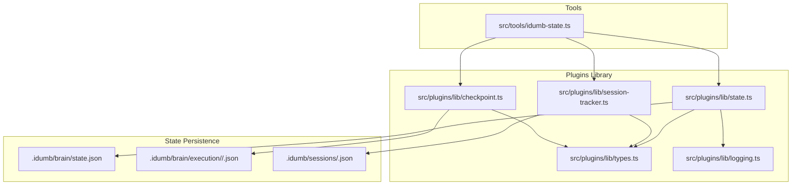
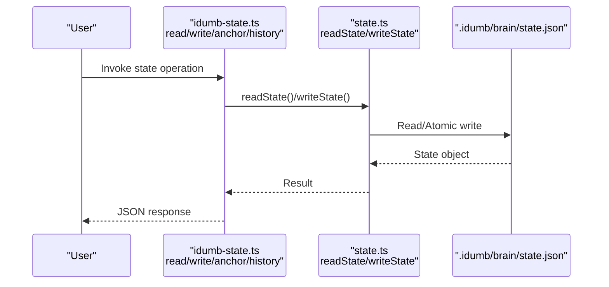
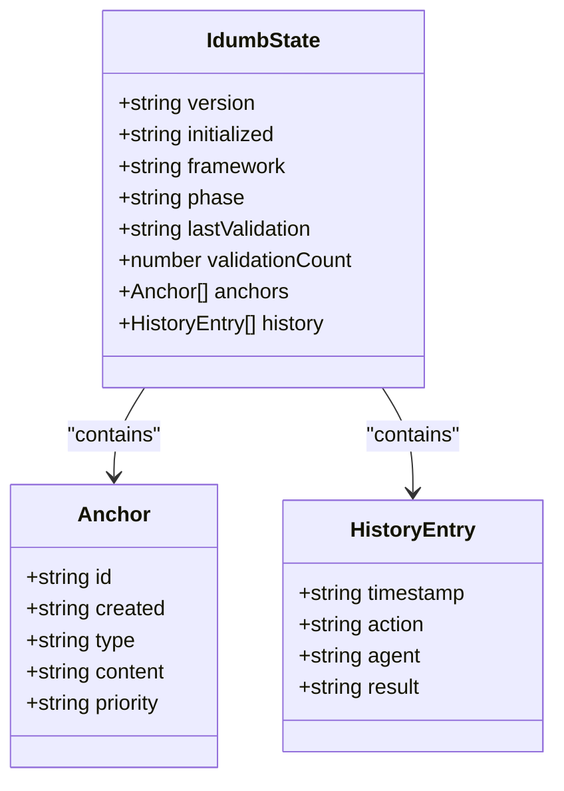
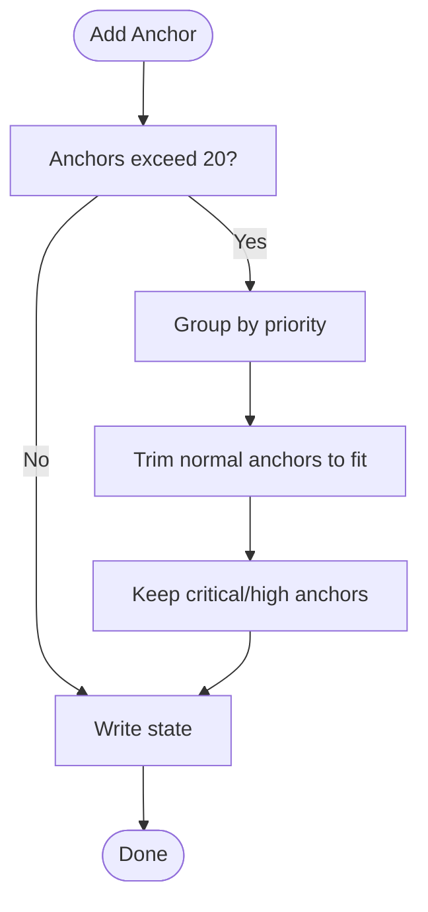
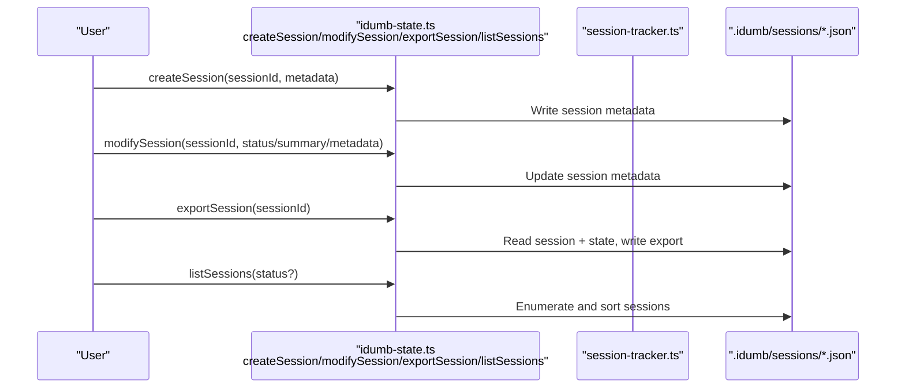
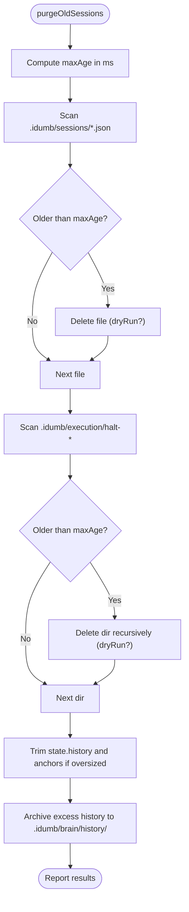
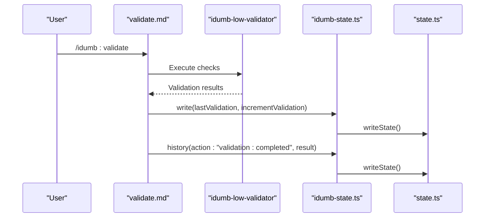
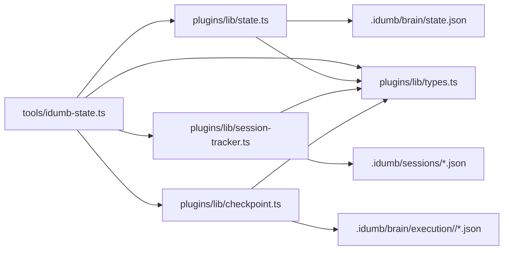

# State Management Tool

<cite>
**Referenced Files in This Document**
- [state.json](file://.idumb/brain/state.json)
- [idumb-state.ts](file://src/tools/idumb-state.ts)
- [state.ts](file://src/plugins/lib/state.ts)
- [types.ts](file://src/plugins/lib/types.ts)
- [session-tracker.ts](file://src/plugins/lib/session-tracker.ts)
- [checkpoint.ts](file://src/plugins/lib/checkpoint.ts)
- [brain-state-schema.json](file://src/schemas/brain-state-schema.json)
- [status.md](file://src/commands/idumb/status.md)
- [validate.md](file://src/commands/idumb/validate.md)
- [logging.ts](file://src/plugins/lib/logging.ts)
</cite>

## Table of Contents
1. [Introduction](#introduction)
2. [Project Structure](#project-structure)
3. [Core Components](#core-components)
4. [Architecture Overview](#architecture-overview)
5. [Detailed Component Analysis](#detailed-component-analysis)
6. [Dependency Analysis](#dependency-analysis)
7. [Performance Considerations](#performance-considerations)
8. [Troubleshooting Guide](#troubleshooting-guide)
9. [Conclusion](#conclusion)
10. [Appendices](#appendices)

## Introduction
This document describes the iDumb State Management Tool, which persists and manipulates governance state in .idumb/brain/state.json. It covers the state data model, file operations, state manipulation functions (read, write, anchor, history), session management, anchor preservation during compaction, and garbage collection. It also provides practical examples, validation and recovery procedures, and error handling guidance.

## Project Structure
The state management system spans two primary modules:
- Tools module: exposes CLI-friendly tools for state operations and session management
- Plugins library: provides robust state read/write and auxiliary utilities

**Diagram sources**
- [idumb-state.ts](file://src/tools/idumb-state.ts#L1-L583)
- [state.ts](file://src/plugins/lib/state.ts#L1-L189)
- [types.ts](file://src/plugins/lib/types.ts#L1-L282)
- [session-tracker.ts](file://src/plugins/lib/session-tracker.ts#L1-L385)
- [checkpoint.ts](file://src/plugins/lib/checkpoint.ts#L1-L357)
- [logging.ts](file://src/plugins/lib/logging.ts#L1-L118)

**Section sources**
- [idumb-state.ts](file://src/tools/idumb-state.ts#L1-L583)
- [state.ts](file://src/plugins/lib/state.ts#L1-L189)
- [types.ts](file://src/plugins/lib/types.ts#L1-L282)
- [session-tracker.ts](file://src/plugins/lib/session-tracker.ts#L1-L385)
- [checkpoint.ts](file://src/plugins/lib/checkpoint.ts#L1-L357)
- [logging.ts](file://src/plugins/lib/logging.ts#L1-L118)

## Core Components
- IdumbState interface defines the governance state shape, including versioning, initialization, framework, phase, validation counters, anchors, and history.
- Anchor system preserves critical context during compaction with priority levels (critical, high, normal).
- History records governance actions with timestamps, agents, and outcomes.
- Session management tracks long-running workflows with metadata persistence and export capabilities.
- Garbage collection trims old sessions, checkpoints, and state history to maintain performance and storage hygiene.

**Section sources**
- [types.ts](file://src/plugins/lib/types.ts#L20-L51)
- [state.json](file://.idumb/brain/state.json#L1-L356)
- [brain-state-schema.json](file://src/schemas/brain-state-schema.json#L1-L112)

## Architecture Overview
The state management architecture separates concerns between user-facing tools and internal library utilities. Tools provide ergonomic APIs for state reads/writes and session operations, while the library ensures atomic writes, history trimming, and robust error handling.

**Diagram sources**
- [idumb-state.ts](file://src/tools/idumb-state.ts#L62-L79)
- [state.ts](file://src/plugins/lib/state.ts#L34-L73)

## Detailed Component Analysis

### State Data Model and File Operations
- State file: .idumb/brain/state.json
- Schema validation: brain-state-schema.json constrains structure, types, and sizes
- Atomic writes: state.ts implements atomic write via temporary file and rename to prevent corruption
- Defaults: idumb-state.ts provides a default state template for initialization

**Diagram sources**
- [types.ts](file://src/plugins/lib/types.ts#L20-L51)
- [brain-state-schema.json](file://src/schemas/brain-state-schema.json#L54-L111)

**Section sources**
- [state.json](file://.idumb/brain/state.json#L1-L356)
- [brain-state-schema.json](file://src/schemas/brain-state-schema.json#L1-L112)
- [state.ts](file://src/plugins/lib/state.ts#L34-L73)
- [idumb-state.ts](file://src/tools/idumb-state.ts#L40-L49)

### State Manipulation Functions

#### read()
- Purpose: Read current governance state from .idumb/brain/state.json
- Behavior: Returns default state if file is missing or unreadable; optionally enriches with smart context
- Output: JSON string representation of state

**Section sources**
- [idumb-state.ts](file://src/tools/idumb-state.ts#L82-L114)
- [state.ts](file://src/plugins/lib/state.ts#L34-L45)

#### write()
- Purpose: Update state fields (phase, framework, lastValidation) and optionally increment validationCount
- Behavior: Reads current state, applies changes, writes atomically, returns updated state

**Section sources**
- [idumb-state.ts](file://src/tools/idumb-state.ts#L117-L136)
- [state.ts](file://src/plugins/lib/state.ts#L51-L73)

#### anchor()
- Purpose: Add an anchor that survives compaction
- Behavior: Creates anchor with id, timestamp, type, content, and priority; trims to limits preserving critical and high-priority anchors; writes state

**Section sources**
- [idumb-state.ts](file://src/tools/idumb-state.ts#L139-L176)
- [state.json](file://.idumb/brain/state.json#L17-L53)

#### history()
- Purpose: Append a governance action to history
- Behavior: Adds entry with timestamp, action, agent, and result; keeps last 50 entries; writes state

**Section sources**
- [idumb-state.ts](file://src/tools/idumb-state.ts#L179-L205)
- [state.json](file://.idumb/brain/state.json#L54-L356)

#### getAnchors()
- Purpose: Retrieve anchors formatted for compaction context injection
- Behavior: Filters by priority and formats a summary for injection

**Section sources**
- [idumb-state.ts](file://src/tools/idumb-state.ts#L208-L232)

### Anchor System for Context Preservation
- Priority levels: critical, high, normal
- Automatic cleanup: when exceeding capacity, retains critical anchors and prunes oldest normal anchors first
- Survivability: anchors are preserved during compaction and export workflows

**Diagram sources**
- [idumb-state.ts](file://src/tools/idumb-state.ts#L159-L171)

**Section sources**
- [idumb-state.ts](file://src/tools/idumb-state.ts#L139-L176)
- [state.json](file://.idumb/brain/state.json#L17-L53)

### Session Management
Session tracking persists metadata for long-running workflows and supports export for archival.

**Diagram sources**
- [idumb-state.ts](file://src/tools/idumb-state.ts#L261-L459)
- [session-tracker.ts](file://src/plugins/lib/session-tracker.ts#L204-L259)

Key operations:
- createSession: initializes session metadata and persists to .idumb/sessions
- modifySession: updates status, summary, and merges metadata
- exportSession: packages session and state for long-term storage
- listSessions: enumerates sessions with optional filtering and summary counts

**Section sources**
- [idumb-state.ts](file://src/tools/idumb-state.ts#L261-L459)
- [session-tracker.ts](file://src/plugins/lib/session-tracker.ts#L204-L259)

### Garbage Collection
Automated cleanup maintains system health by removing old artifacts.

**Diagram sources**
- [idumb-state.ts](file://src/tools/idumb-state.ts#L465-L579)

**Section sources**
- [idumb-state.ts](file://src/tools/idumb-state.ts#L465-L579)

### Validation and Recovery Procedures
- Validation command orchestrates structure, schema, freshness, alignment, and integrity checks
- State updates lastValidation and increments validationCount upon successful validation
- Critical findings are anchored for future recovery

**Diagram sources**
- [validate.md](file://src/commands/idumb/validate.md#L286-L302)
- [idumb-state.ts](file://src/tools/idumb-state.ts#L117-L136)
- [state.ts](file://src/plugins/lib/state.ts#L79-L101)

**Section sources**
- [validate.md](file://src/commands/idumb/validate.md#L1-L518)
- [idumb-state.ts](file://src/tools/idumb-state.ts#L117-L136)
- [state.ts](file://src/plugins/lib/state.ts#L79-L101)

## Dependency Analysis
The tools module depends on the plugins library for robust state operations and shared types. The library encapsulates filesystem operations and validation logic.

**Diagram sources**
- [idumb-state.ts](file://src/tools/idumb-state.ts#L1-L14)
- [state.ts](file://src/plugins/lib/state.ts#L1-L12)
- [types.ts](file://src/plugins/lib/types.ts#L1-L8)

**Section sources**
- [idumb-state.ts](file://src/tools/idumb-state.ts#L1-L14)
- [state.ts](file://src/plugins/lib/state.ts#L1-L12)
- [types.ts](file://src/plugins/lib/types.ts#L1-L8)

## Performance Considerations
- Atomic writes: Temporary file plus rename minimizes risk of partial writes
- History and anchors trimming: Maintains bounded growth to keep state.json small and fast to parse
- Garbage collection: Periodic cleanup of old sessions and checkpoints prevents filesystem bloat
- Log rotation: Prevents plugin.log from growing unbounded

[No sources needed since this section provides general guidance]

## Troubleshooting Guide
Common issues and remedies:
- State file missing or corrupted: read() returns default state; use /idumb:validate to repair structure and schema
- Excessive history/anchors: purgeOldSessions trims history and anchors; consider exporting critical anchors first
- Stale context warnings: run freshness validators and refresh context
- Session not found: verify sessionId and existence of .idumb/sessions/<sessionId>.json

Practical examples:
- Query current state: use read() to fetch JSON state
- Update phase and increment validation: use write() with phase and incrementValidation
- Add a critical anchor: use anchor() with priority critical
- Record a governance action: use history() with action and result
- Export session for archival: use exportSession() with sessionId

Recovery procedures:
- Repair structure: /idumb:init --repair
- Validate and update state: /idumb:validate
- Export critical context: exportSession() with includeAnchors=true
- Cleanup old artifacts: purgeOldSessions()

**Section sources**
- [idumb-state.ts](file://src/tools/idumb-state.ts#L82-L205)
- [validate.md](file://src/commands/idumb/validate.md#L1-L518)
- [status.md](file://src/commands/idumb/status.md#L1-L398)

## Conclusion
The iDumb State Management Tool provides a robust, schema-constrained governance state persisted in .idumb/brain/state.json. Its tools and library components offer safe, atomic state operations, anchor-based context preservation, session lifecycle management, and automated cleanup. Together with validation and recovery workflows, they ensure reliable governance state maintenance across complex, multi-agent operations.

[No sources needed since this section summarizes without analyzing specific files]

## Appendices

### Practical Examples Index
- Read state: [idumb-state.ts](file://src/tools/idumb-state.ts#L82-L114)
- Write state: [idumb-state.ts](file://src/tools/idumb-state.ts#L117-L136)
- Add anchor: [idumb-state.ts](file://src/tools/idumb-state.ts#L139-L176)
- Record history: [idumb-state.ts](file://src/tools/idumb-state.ts#L179-L205)
- Export session: [idumb-state.ts](file://src/tools/idumb-state.ts#L353-L414)
- Purge old sessions: [idumb-state.ts](file://src/tools/idumb-state.ts#L465-L579)

### State Structure Reference
- Core fields: version, initialized, framework, phase, lastValidation, validationCount, anchors, history
- Anchor fields: id, created, type, content, priority
- History entry fields: timestamp, action, agent, result

**Section sources**
- [types.ts](file://src/plugins/lib/types.ts#L20-L51)
- [brain-state-schema.json](file://src/schemas/brain-state-schema.json#L54-L111)
- [state.json](file://.idumb/brain/state.json#L1-L356)